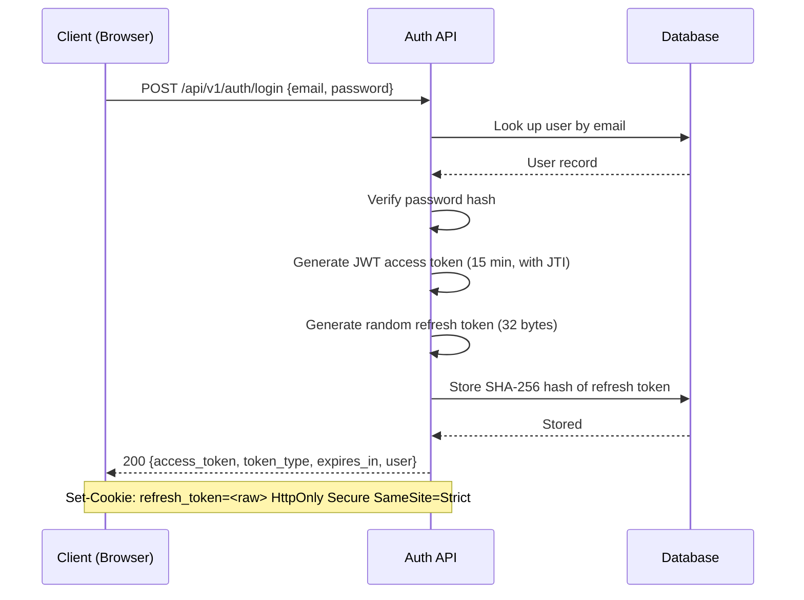
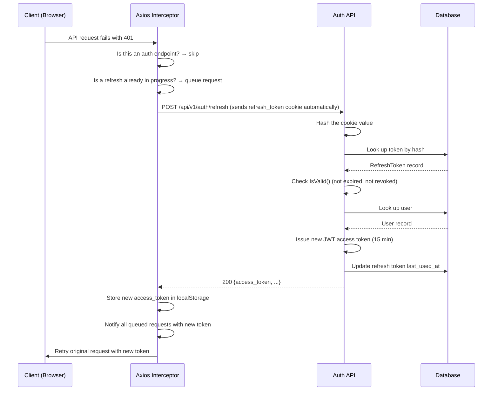
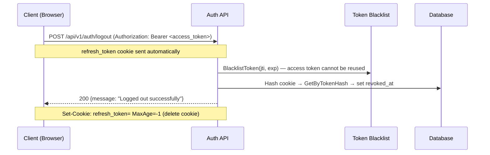

# Refresh Token System

## Overview

Inventario uses a **dual-token authentication model**: a short-lived JWT access token
combined with a long-lived refresh token. This design limits the damage window of a
stolen access token while keeping users logged in across browser sessions without
requiring them to re-enter credentials every 15 minutes.

## Token Types

| Property | Access Token | Refresh Token |
|---|---|---|
| Lifetime | 15 minutes | 30 days |
| Format | Signed JWT (HS256) | Random 256-bit value |
| Transport | `Authorization: Bearer` header | httpOnly Secure cookie |
| Storage (client) | `localStorage` | Browser cookie (not accessible via JS) |
| Storage (server) | Stateless (validated by signature) | SHA-256 hash in DB |
| Revocable | Yes (via blacklist) | Yes (DB `revoked_at` field) |
| Scope | Any API endpoint | Auth endpoints only (`/api/v1/auth`) |

The refresh token cookie is set with `HttpOnly`, `Secure`, and `SameSite=Strict` flags,
which means JavaScript cannot read it and it will not be sent to third-party origins.

## Authentication Flows

### Login



On success, the client receives:
- The **access token** in the JSON body — stored in `localStorage` and attached to
  subsequent API requests via `Authorization: Bearer`.
- The **refresh token** as a cookie — the browser stores it automatically; it is
  invisible to JavaScript.

The raw refresh token value is **never stored on the server**. Only its SHA-256 hash
is persisted in the `refresh_tokens` table, so a database breach does not expose
usable tokens.

---

### Normal API Request

Once authenticated, every API request includes the access token:

```
Client  ──── GET /api/v1/... Bearer <access_token> ────►  API
        ◄─── 200 + data ─────────────────────────────────
```

The JWT middleware:
1. Extracts the token from `Authorization: Bearer` (or `?token=` query param for file access).
2. Verifies the HMAC-SHA256 signature and expiration.
3. If a blacklist service is wired, checks that the token's `jti` claim has not been
   revoked and that the user has not been force-logged-out.
4. Loads the user record from the database and injects it into the request context.

---

### Silent Token Refresh (Frontend)

When an access token expires, the frontend automatically obtains a new one without
user interaction:



Key properties of the refresh interceptor:
- **Deduplication**: if multiple requests fail with 401 simultaneously, only one refresh
  call is made; other requests are queued and retried once the new token arrives.
- **Loop prevention**: auth endpoint requests (`/auth/*`) are never retried to avoid
  infinite loops on credential failures.
- **Graceful degradation**: if the refresh call itself fails (cookie missing, token
  expired, revoked), the interceptor clears local auth state and redirects to `/login`.

---

### Logout



After logout:
- The **access token** is added to the blacklist keyed by its `jti` claim for the
  remainder of its TTL. Any in-flight request using the old token will be rejected.
- The **refresh token** record in the database has its `revoked_at` timestamp set,
  preventing any future refresh using that cookie.
- The browser cookie is deleted by sending a `Set-Cookie` with `MaxAge=-1`.

---

## Backend Design

### Component Overview

```
┌──────────────────────────────────────────────────┐
│                  HTTP Request                    │
└──────────────────┬───────────────────────────────┘
                   │
        ┌──────────▼──────────┐
        │   JWTMiddleware     │  ← validates token signature,
        │  (RequireAuth)      │    expiry, blacklist, user
        └──────────┬──────────┘
                   │ (user injected into context)
        ┌──────────▼──────────┐
        │    Route Handler    │
        └─────────────────────┘

Auth-specific routes (/api/v1/auth/*):
  POST /login    → issues access token + refresh cookie
  POST /refresh  → exchanges refresh cookie for new access token
  POST /logout   → revokes both tokens
  GET  /me       → returns current user (requires auth)
```

### Access Token (JWT)

The JWT payload contains:

```
{
  "jti":     "<uuid>",        // unique token ID for blacklisting
  "user_id": "<uuid>",        // user identifier
  "role":    "admin|viewer",  // user role
  "iat":     <unix timestamp>,
  "exp":     <unix timestamp> // iat + 15 minutes
}
```

The token is signed with HMAC-SHA256 using the server's `--jwt-secret`.

### Refresh Token (Database Record)

```
refresh_tokens table
├── id           (UUID)
├── tenant_id    (UUID, FK → tenants)
├── user_id      (UUID, FK → users)
├── token_hash   (VARCHAR 128) — SHA-256 of the raw token, URL-safe base64
├── expires_at   (TIMESTAMP)   — 30 days from creation
├── created_at   (TIMESTAMP)
├── last_used_at (TIMESTAMP)   — updated on each successful refresh
├── ip_address   (VARCHAR 45)  — client IP at creation
├── user_agent   (TEXT)        — browser UA at creation
└── revoked_at   (TIMESTAMP)   — set on logout; NULL = active
```

Row-Level Security policies ensure that application-role queries are automatically
filtered by `tenant_id` + `user_id`, preventing cross-user data access even if
application logic has a bug.

### Token Blacklist

The blacklist supports two granularities:

| Operation | Purpose |
|---|---|
| `BlacklistToken(jti, exp)` | Revoke a single access token (used on logout) |
| `BlacklistUserTokens(userID, duration)` | Force-logout all sessions (e.g., password change) |

Three implementations are provided:

- **Redis** (recommended for production, multi-instance) — uses `SET key 1 EX <ttl>`;
  entries auto-expire, no manual cleanup needed.
- **In-memory** (single-instance, non-persistent) — uses a guarded map with a
  background cleanup goroutine. State is lost on restart.
- **No-op** (development only) — never blocks any token. Suitable when 15-minute
  TTLs are an acceptable trade-off.

---

## Frontend Design

### Token Storage

| Data | Storage | Reason |
|---|---|---|
| Access token | `localStorage` | Must be readable by JS to attach to `Authorization` header |
| Refresh token | httpOnly cookie | Managed by browser; not accessible to JS — XSS-proof |
| User profile | `localStorage` | Cached for immediate display without an extra API call |

### Request Pipeline

```
┌──────────────┐   attach Bearer token   ┌──────────────────┐
│  Vue component│ ──── API request ──────►│  Request          │
│  / Pinia store│                         │  Interceptor      │
└──────────────┘                         └─────────┬────────┘
                                                   │
                                          ┌────────▼────────┐
                                          │  Backend API     │
                                          └────────┬────────┘
                                                   │
                                          ┌────────▼────────────────────┐
                                          │  Response Interceptor        │
                                          │                              │
                                          │  200 → pass through          │
                                          │                              │
                                          │  401 (non-auth endpoint):    │
                                          │   1. Call POST /auth/refresh │
                                          │   2. Store new access_token  │
                                          │   3. Retry original request  │
                                          │                              │
                                          │  401 (refresh failed):       │
                                          │   clear localStorage         │
                                          │   redirect to /login         │
                                          └──────────────────────────────┘
```

### Concurrent Request Handling

If multiple requests fail with 401 at the same time (e.g., several components load
simultaneously with an expired token), a flag prevents multiple concurrent refresh
calls. Requests that arrive while a refresh is in progress are queued and retried with
the new token as soon as it arrives.

```
Request A  ─── 401 ──► start refresh ──────────────── retry with new token ──►
Request B  ─── 401 ──► queue ─────────────────────── retry with new token ──►
Request C  ─── 401 ──► queue ─────────────────────── retry with new token ──►
                              │ POST /auth/refresh │
```

---

## Security Considerations

### Why httpOnly Cookies for the Refresh Token?

XSS attacks can steal values from `localStorage`, but cannot read httpOnly cookies.
Keeping the long-lived refresh token in a cookie means a successful XSS attack can
only use the access token until it expires (≤ 15 minutes), and cannot silently
extend the session.

### Why Hash the Refresh Token in the Database?

A database breach would otherwise expose raw refresh tokens, giving attackers
permanent session access. Storing only the SHA-256 hash means the attacker gets
unusable hashes; the raw token only ever exists in transit and in the browser cookie.

### Cookie Flags

- `HttpOnly` — not readable by JavaScript
- `Secure` — only sent over HTTPS
- `SameSite=Strict` — not sent on cross-site requests; prevents CSRF
- `Path=/api/v1/auth` — scope limited to auth endpoints only; not sent on regular API calls

### JTI and Immediate Revocation

Because access tokens are stateless JWTs, they remain valid until expiry even after
logout — unless the server maintains a blacklist. The `jti` (JWT ID) claim is a unique
identifier per token that allows instant revocation by adding it to the blacklist on
logout.

### Multi-Instance Deployments

The in-memory blacklist does not share state between server instances. For deployments
with more than one backend process, configure the Redis blacklist so that a token
blacklisted by instance A is also rejected by instance B.

---

## Configuration Summary

| Setting | Description |
|---|---|
| `--jwt-secret` | Required. HMAC signing key for access tokens. |
| Redis URL | Optional. If provided, uses Redis blacklist; otherwise in-memory. |
| Access token TTL | 15 minutes (hard-coded; adjust `accessTokenExpiration` in `auth.go`). |
| Refresh token TTL | 30 days (hard-coded; adjust `refreshTokenExpiration` in `auth.go`). |
