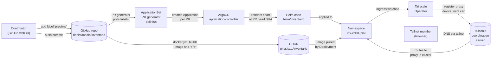
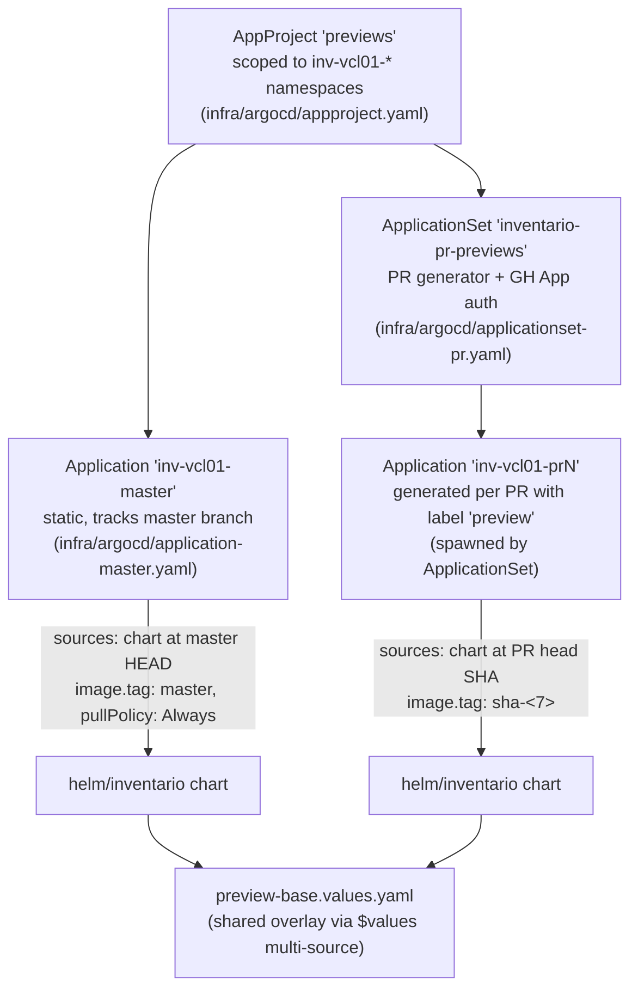
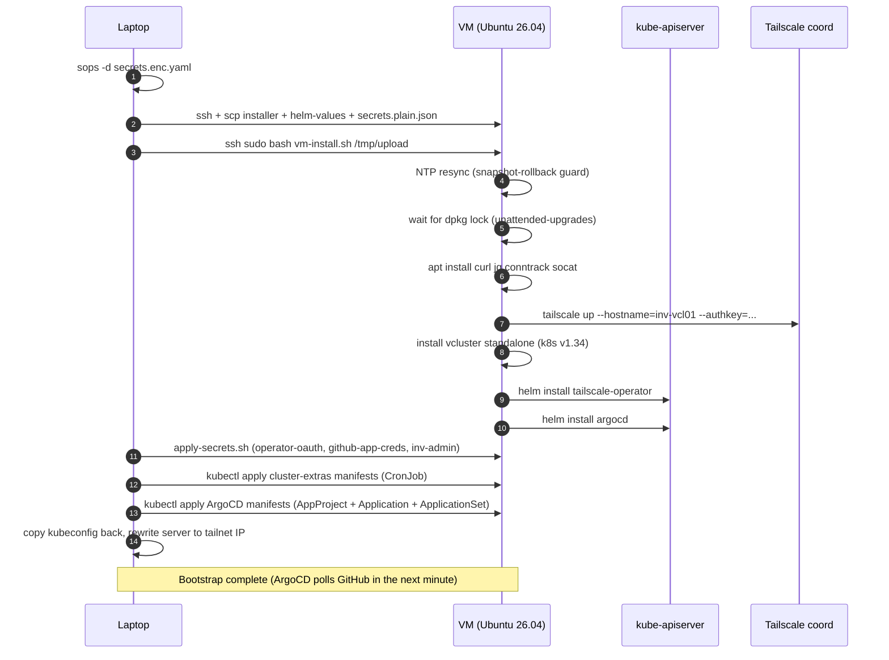
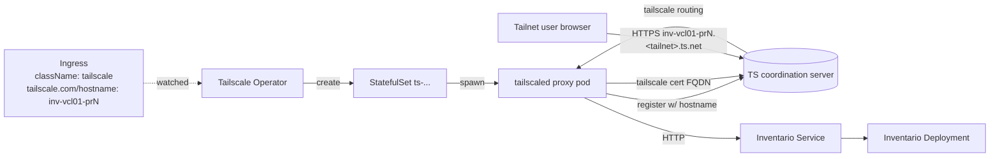
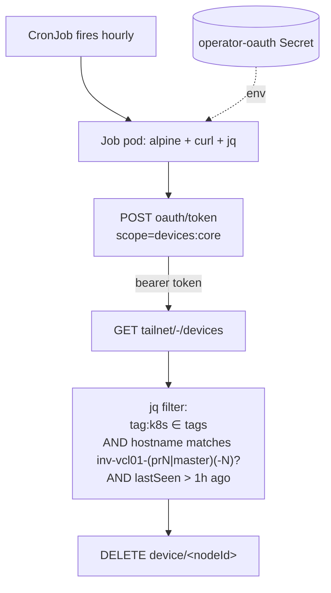
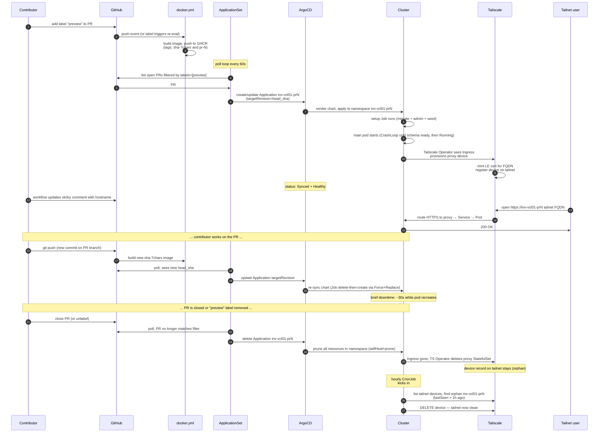

# Inventario dev preview-env — architecture

> One-stop document for the Phase 1 PR-preview infrastructure landed
> under epic [#1852](https://github.com/denisvmedia/inventario/issues/1852).
> Reading order at the bottom — pick "I want a working preview in five
> minutes" or "I want to know how it works" depending on what you need.

---

## TL;DR

| Question | Answer |
|---|---|
| **What does it give a contributor?** | Label a PR `preview` → within ~5 min the PR comment posts a hostname `inv-vcl01-prN`. Any tailnet member opens `https://inv-vcl01-prN.<tailnet>.ts.net/` and gets a fully-functional Inventario with that PR's code, demo Postgres/Redis/MinIO, and seeded sample data. Unlabel or close the PR → preview disappears within a poll cycle. |
| **What is the cluster?** | A single Ubuntu 26.04 VM (you provision it on any hypervisor or cloud — Proxmox, Hetzner, DigitalOcean, …) running [vcluster](https://www.vcluster.com) standalone with [ArgoCD](https://argo-cd.readthedocs.io) on top and the [Tailscale Kubernetes Operator](https://tailscale.com/kb/1236/kubernetes-operator) for tailnet-bound Ingresses. |
| **How does a PR turn into a preview?** | ArgoCD's [ApplicationSet](https://argo-cd.readthedocs.io/en/stable/operator-manual/applicationset/) PR generator polls GitHub every 60 s, sees PRs labeled `preview`, spawns an `Application` per PR that templates the helm chart at the PR's head commit. ArgoCD syncs the chart into a per-PR namespace. The Tailscale Operator notices the chart's Ingress, provisions a tailnet proxy node with a `tailscale.com/hostname` annotation, and the URL becomes reachable. |
| **What's NOT in scope (yet)?** | Auto-rollout when only the `master` tag's digest changes ([#1885](https://github.com/denisvmedia/inventario/issues/1885)); production-grade admin password from sops ([#1883](https://github.com/denisvmedia/inventario/issues/1883)); in-place migrations under ArgoCD upgrade ([#1884](https://github.com/denisvmedia/inventario/issues/1884)); chart-side `tls[].secretName` polish ([#1882](https://github.com/denisvmedia/inventario/issues/1882)); direct tailnet exposure of the ArgoCD UI and vcluster API ([#1892](https://github.com/denisvmedia/inventario/issues/1892)). |

---

## Big picture



The dev flow has three independent loops:

1. **Image loop** — `docker.yml` on GitHub Actions: every push to a PR that touches `image_inputs` (Dockerfile, `go/`, `frontend/`, `helm/`, `infra/argocd/`, etc.) builds a multi-arch image and tags it `pr-N` + `sha-<7>`. PR-preview Applications pin the immutable `sha-<7>` tag.
2. **Sync loop** — ArgoCD's ApplicationSet PR generator polls GitHub (`appSecretName: github-app-creds` — see [#1854](https://github.com/denisvmedia/inventario/issues/1854) for the GitHub App). On seeing a PR with the `preview` label, it spawns/updates an Application; ArgoCD reconciles the rendered chart against the cluster.
3. **Tailnet loop** — the chart's Ingress (`ingressClassName: tailscale`) is picked up by the [Tailscale Operator](https://tailscale.com/kb/1236/kubernetes-operator-cluster-ingress), which provisions a per-Ingress proxy pod that joins the tailnet under the requested hostname, exchanges TLS via the coordination server, and proxies HTTPS traffic to the backing Service.

Two ancillary loops keep the system healthy:

4. **PR comment loop** — `.github/workflows/pr-preview-status.yml`: on each PR event (`labeled` / `synchronize` / `unlabeled` / `closed`) updates a sticky comment with the deployed hostname.
5. **Tailnet-device GC loop** — `infra/vm/cluster-extras/ts-orphan-cleanup.yaml`: hourly CronJob inside the cluster that lists tailnet devices, finds orphan records matching the PR-preview naming convention that have been offline > 1 hour, and `DELETE`s them via the TS API. Without this, every closed PR (or snapshot-rolled-back cluster) would leave a stale device record holding the original hostname slot, and the next deploy of the same PR number would get a `-1`/`-2` suffix.

---

## Physical layout

```
+---------------------------------------------------------------------+
| Contributor laptop                                                  |
|                                                                     |
|   /Users/buster/Work/denis/inventario                               |
|     infra/vm/bootstrap.sh    (orchestrator — run from laptop)       |
|     infra/vm/vm-install.sh   (runs ON the VM, scp'd by bootstrap)   |
|     infra/vm/secrets/        (sops-encrypted bundle, age key)       |
|     infra/argocd/            (AppProject + Application + AppSet)    |
|     infra/vm/cluster-extras/ (ts-orphan-cleanup CronJob)            |
|     ~/.kube/inv-vcl01.config (kubeconfig, populated by bootstrap)   |
|                                                                     |
+--------------------------------+------------------------------------+
                                 |
                                 |  ssh + Tailscale (laptop is also a tailnet member)
                                 v
+---------------------------------------------------------------------+
| Hypervisor host  (your Proxmox / Hetzner / etc.)                    |
|                                                                     |
|   +-----------------------------------------------------------+     |
|   | The VM  (Ubuntu 26.04, ~4 vCPU, ~8 GiB RAM)               |     |
|   |   Tailscale hostname: inv-vcl01                           |     |
|   |   Pre-bootstrap snapshot recommended (for rollback)       |     |
|   |                                                           |     |
|   |   +------------------------------------------+            |     |
|   |   | vcluster standalone v0.34.0              |            |     |
|   |   |   k8s v1.34.0, single-VM CP + worker     |            |     |
|   |   |   kubeconfig: /var/lib/vcluster/         |            |     |
|   |   |              kubeconfig.yaml             |            |     |
|   |   |                                          |            |     |
|   |   | Namespaces:                              |            |     |
|   |   |   argocd/      ArgoCD core               |            |     |
|   |   |   tailscale/   TS Operator + proxy STSs  |            |     |
|   |   |   inv-system/  shared admin secret       |            |     |
|   |   |   inv-vcl01-pr<N>/  per-PR preview ns    |            |     |
|   |   |   inv-vcl01-master/ master preview ns    |            |     |
|   |   +------------------------------------------+            |     |
|   +-----------------------------------------------------------+     |
|                                                                     |
+--------------------------------+------------------------------------+
                                 |
                                 |  Tailscale (operator proxies <-> coordination server)
                                 v
+---------------------------------------------------------------------+
| Tailscale tailnet  (MagicDNS suffix: <tailnet>.ts.net)              |
|                                                                     |
|   Devices (tag:k8s, ephemeral life-cycle):                          |
|     inv-vcl01-prN.<tailnet>.ts.net    PR preview proxy              |
|     inv-vcl01-master.<tailnet>.ts.net master preview proxy          |
|     inv-vcl01.<tailnet>.ts.net        VM itself                     |
|                                                                     |
|   Operator devices (tag:k8s-operator):                              |
|     tailscale-operator.<tailnet>.ts.net  operator pod's identity    |
|                                                                     |
|   Contributor laptops, CI runners, other developer machines, ...    |
|                                                                     |
+---------------------------------------------------------------------+
```

Nothing in this layout is exposed to the public internet:
- The VM's tailscaled is the only inbound; SSH is gated by Tailscale ACL.
- The TS Operator's Ingresses serve `*.<tailnet>.ts.net` only — MagicDNS resolves only inside the tailnet.
- ArgoCD UI and vcluster API are also tailnet-internal ([#1892](https://github.com/denisvmedia/inventario/issues/1892) will surface them as proper hostnames; today reached via `kubectl port-forward` + the kubeconfig).

---

## Logical layout: ArgoCD topology



Three ArgoCD resources land at bootstrap time (applied by `bootstrap.sh` via `kubectl apply`):

| Resource | File | Purpose |
|---|---|---|
| `AppProject previews` | `infra/argocd/appproject.yaml` | Restricts both source repos (`denisvmedia/inventario` only) and destination namespaces (`inv-vcl01-*` only). Belt-and-suspenders so a malformed Application can't reach into `argocd`, `tailscale`, `inv-system`, etc. |
| `Application inv-vcl01-master` | `infra/argocd/application-master.yaml` | Continuously deploys the master branch to namespace `inv-vcl01-master`. Image pinned to the moving `master` tag with `pullPolicy: Always`. |
| `ApplicationSet inventario-pr-previews` | `infra/argocd/applicationset-pr.yaml` | Per-PR previews. `goTemplate: true` + `goTemplateOptions: [missingkey=error]`. Generates one Application per open PR labeled `preview`; image pinned to the PR's `sha-<7>` (immutable). |

Both Applications layer the **shared overlay** `infra/helm-overlays/preview-base.values.yaml` via ArgoCD's multi-source `$values` mechanism — same demo deps (Postgres/Redis/MinIO), same `argocdMode: true` for the setup Job, same admin credentials. Per-Application bits (image tag, ingress hostname, FQDN) layer on top via inline `helm.values`.

---

## Component-by-component

### 1. `bootstrap.sh` (laptop) and `vm-install.sh` (VM)



The script is **idempotent** — re-running it is the upgrade path. Notable defensive bits:

- **NTP resync before apt.** Snapshot rollback restores the kernel clock to T0; without re-stepping NTP, `apt-get update` rejects the archive InRelease ("not valid yet") and JWT exchanges (GitHub App, ArgoCD auth) fail with "iat in the past". The script polls `timedatectl show -p NTPSynchronized` up to 30 s and hard-exits with a `timedatectl status` dump if NTP never converges.
- **dpkg-lock wait before apt.** Ubuntu cloud images run `unattended-upgrades` on first boot; racing it produces `Could not get lock /var/lib/dpkg/lock-frontend`. The script waits up to 10 min with a 30 s progress heartbeat.
- **Single bash literal substitution** (`${var//search/replace}`) for the `<TAILNET>` placeholder in ArgoCD manifests — avoids `sed`'s `&`/backslash gotchas.
- **No skip on missing secrets.** If sops bundle isn't present, the script still brings vcluster + ArgoCD up but warns loudly; downstream Applications will fail until the operator credentials land.

### 2. Sops bundle (`infra/vm/secrets/`) + `apply-secrets.sh`

Single source of truth for every credential. Schema at `infra/vm/secrets/secrets.example.yaml`:

```yaml
admin:
  email: ""
  password: ""        # NOT used in Phase 1 chart overlay (see follow-up #1883)

tailscale:
  auth_key: ""                # one-shot, only for tailscale up
  oauth_client_id: ""         # operator + cleanup CronJob (auth_keys + devices:core)
  oauth_client_secret: ""
  tailnet_name: ""            # MagicDNS suffix, e.g. "giraffa-duck"

github:
  app_id: ""                  # ArgoCD repo-server + ApplicationSet PR generator
  app_installation_id: ""
  app_private_key: ""
  url: "https://github.com/denisvmedia"
```

`apply-secrets.sh` reads the decrypted JSON and creates Kubernetes Secrets:

| Secret | Namespace | Consumed by |
|---|---|---|
| `inv-system/inventario-admin` | `inv-system` | Shared admin credentials (not yet wired into chart; #1883) |
| `argocd/github-app-creds` | `argocd` | ArgoCD repo-creds + ApplicationSet PR generator (`appSecretName`) |
| `tailscale/operator-oauth` | `tailscale` | TS Operator (mint proxy auth keys) AND `ts-orphan-cleanup` CronJob (LIST + DELETE device records). The single OAuth client carries both `auth_keys` and `devices:core` scopes on `tag:k8s`. |

The **same** OAuth client serves the operator and the cleanup CronJob — verified empirically (the `devices:core` scope name is mandatory; bare `devices` is rejected by the TS token endpoint).

### 3. vcluster

Single-node K3s-flavoured Kubernetes inside the VM. Standalone install (`install-standalone.sh`), config at `/etc/vcluster/vcluster.yaml`:

```yaml
controlPlane:
  distro:
    k8s:
      version: v1.34.0
```

The VM acts as both control-plane and worker (no taint, no separate node). The kubeconfig is at `/var/lib/vcluster/kubeconfig.yaml`; `bootstrap.sh` copies it to `~/.kube/inv-vcl01.config` on the laptop with the API server rewritten to the VM's tailnet IP + `tls-server-name: 127.0.0.1` (vcluster's cert SAN is for `127.0.0.1` only — [#1892](https://github.com/denisvmedia/inventario/issues/1892) will fix this by re-issuing with the tailnet FQDN in SAN).

### 4. Tailscale Operator

Installed by `vm-install.sh` via `helm install tailscale/tailscale-operator` with:

- Static values from `infra/vm/helm-values/tailscale-operator.yaml` (`tag:k8s-operator`, `tag:k8s`, resource requests/limits).
- Dynamic OAuth from a temp values file rendered from the sops bundle (`oauth.clientId`, `oauth.clientSecret`).

The operator runs as a Deployment in namespace `tailscale`, watches `Ingress` and `Service` resources cluster-wide for `ingressClassName: tailscale` or `loadBalancerClass: tailscale`, and for each one:

1. Mints an auth key via the OAuth client.
2. Creates a `StatefulSet` (`ts-<resource-name>-<random>`) running `tailscale/tailscale:vX.Y.Z` (containerboot).
3. The proxy pod joins the tailnet using the auth key and requested hostname annotation.
4. The proxy serves traffic from the cluster Service to the tailnet (HTTPS termination for Ingress, raw TCP for LB Service).



### 5. ArgoCD AppProject / Application / ApplicationSet

**AppProject** scopes both source repo and destination namespaces — sourceRepos `denisvmedia/inventario` only, destinations `inv-vcl01-*` only. So an Application can't accidentally try to deploy into `argocd` or `tailscale`.

**Application `inv-vcl01-master`** is static. Two sources via `$values` multi-source pattern:

```yaml
sources:
  - repoURL: https://github.com/denisvmedia/inventario
    targetRevision: master
    path: helm/inventario
    helm:
      valueFiles:
        - $values/infra/helm-overlays/preview-base.values.yaml
      values: |
        image:
          tag: master
          pullPolicy: Always
        ingress:
          annotations: { tailscale.com/hostname: inv-vcl01-master }
          ...
  - repoURL: https://github.com/denisvmedia/inventario
    targetRevision: master
    ref: values        # exposes the repo for $values lookups
```

**ApplicationSet `inventario-pr-previews`** is the live one for PR previews. Critical config:

```yaml
spec:
  goTemplate: true                       # else {{.number}} doesn't substitute
  goTemplateOptions: [missingkey=error]  # fail loud on typos
  generators:
    - pullRequest:
        github:
          owner: denisvmedia
          repo: inventario
          labels: [preview]
          appSecretName: github-app-creds
        requeueAfterSeconds: 60
  template:
    metadata:
      name: 'inv-vcl01-pr{{.number}}'
    spec:
      project: previews
      sources:
        - repoURL: https://github.com/denisvmedia/inventario
          targetRevision: '{{.head_sha}}'
          path: helm/inventario
          helm:
            valueFiles: [$values/infra/helm-overlays/preview-base.values.yaml]
            values: |
              image:
                tag: 'sha-{{ .head_short_sha_7 }}'   # immutable, per-commit
              ingress:
                annotations: { tailscale.com/hostname: 'inv-vcl01-pr{{.number}}' }
                hosts: [{ host: 'inv-vcl01-pr{{.number}}.<TAILNET>.ts.net', ... }]
                ...
        - repoURL: ...
          ref: values
      syncPolicy:
        automated:
          prune: true       # unlabel/close → resources go away
          selfHeal: true    # any drift in the cluster → reconciled
        syncOptions:
          - CreateNamespace=true
          - ServerSideApply=true
```

The `<TAILNET>` placeholder is substituted at apply time (in `bootstrap.sh`) from the sops bundle's `tailscale.tailnet_name`. Keeping this out of the file ArgoCD reads from git makes the file tailnet-agnostic — the same `applicationset-pr.yaml` could run against a different tailnet by changing the sops value.

### 6. Helm chart + preview-base overlay

The chart at `helm/inventario` is the same one shipped to production users (it's what the project deploys). The preview-env work adds **one shared overlay** at `infra/helm-overlays/preview-base.values.yaml`:

| Value | Why |
|---|---|
| `image.repository: ghcr.io/denisvmedia/inventario` | Pin registry. `image.tag` is layered per-Application (immutable sha-7 for PR, moving `master` for master). |
| `run.all.enabled: true`, `replicaCount: 1` | Combined-mode Deployment (apiserver + workers in one pod). Single replica is right for ephemeral state. |
| `demo.{postgresql,redis,minio}.enabled: true` | In-cluster sidecars instead of external databases. No persistence — preview wipes on rebuild by design. |
| `setupJob.argocdMode: true` | See "argocdMode" below. |
| `setupJob.initData.adminPassword: PreviewAdmin123` | Bypasses the binary's password-complexity rejection of the chart's default `admin123` (7 chars). Tailnet-gated so this isn't a public credential. |
| `setupJob.initData.seedDatabase: true` | Seed demo locations/areas/commodities so the preview is interesting to click through. |
| `service.type: ClusterIP`, port 3333; `ingress.enabled: true`, `className: tailscale`, `http-redirect: true` | Exposed via the Tailscale Ingress, not LoadBalancer. |

#### Why `setupJob.argocdMode`

The chart's `setupJob` (DB bootstrap + migrate + admin user creation + seed) is annotated by default with `helm.sh/hook: post-install,pre-upgrade`. That works for `helm install`/`helm upgrade` consumers: Helm applies the main resources first, then runs the post-install hook against an already-Healthy cluster.

ArgoCD interprets Helm hooks **differently**:

- `pre-install`/`pre-upgrade` → ArgoCD **PreSync** phase: hook resources are applied alone, BEFORE the non-hook resources. The setup Job hangs on `pg_isready` (Postgres Service doesn't exist yet — it's a non-hook resource in the Sync phase). Sync stalls forever.
- `post-install`/`post-upgrade` → ArgoCD **PostSync** phase: hook resources are applied AFTER non-hook resources are Healthy. But the main Deployment can't go Healthy until the schema is migrated — and the migration is in the PostSync hook that hasn't run yet. Deadlock.

`argocdMode: true` (chart-level toggle introduced in [#1858](https://github.com/denisvmedia/inventario/issues/1858)):

- Drops the `helm.sh/hook` annotation entirely.
- Adds `argocd.argoproj.io/sync-options: "Force=true,Replace=true"` (Jobs are immutable in K8s — Replace=true makes ArgoCD delete-then-create on each sync rather than fail the apply).
- Drops `ttlSecondsAfterFinished` (selfHeal would otherwise re-fire migrations every 24 h when the cluster GC's the completed Job).

The Job ends up applied **in the default sync wave alongside everything else**. Its existing `pg_isready` loop in the bootstrap init container handles the timing — pg comes up, Job runs migrations, exits. The main app pod CrashLoops 1-2 times on the `bootstrap.go` schema-version guard until migrations land, then succeeds. Same handoff a non-ArgoCD `helm install` would experience.

### 7. GitHub workflows

| Workflow | Trigger | What it does |
|---|---|---|
| `.github/workflows/docker.yml` | PR push, master push, tag push | Builds multi-arch image. PRs get `pr-N` + `sha-<7>` tags; master gets `edge` + `master` + `sha-<7>`. Build is gated by `image_inputs` filter in `.github/filters.yml` — includes `helm/**`, `infra/argocd/**`, `infra/helm-overlays/**` so chart-only PRs still get an image. |
| `.github/workflows/pr-preview-status.yml` | PR `labeled` / `unlabeled` / `synchronize` / `closed` | Updates a single sticky comment on the PR (via `marocchino/sticky-pull-request-comment`) showing the deployed hostname, head SHA, admin credentials, status. |

The sticky comment displays the hostname as **plain text**, not a clickable link. Two reasons:

1. The TS-issued cert covers only the FQDN (`<short>.<tailnet>.ts.net`), so a short HTTP link gets bounced by the TS Operator's same-host HTTP→HTTPS redirect into a cert-mismatch dead-end.
2. Tailnet members already know how to append their tailnet's MagicDNS suffix; non-tailnet readers couldn't reach the URL anyway, so a clickable link would be misleading.

A future "preview catalog" service ([#1892](https://github.com/denisvmedia/inventario/issues/1892) sets the stage) can turn this into a proper redirector.

### 8. `ts-orphan-cleanup` CronJob

`infra/vm/cluster-extras/ts-orphan-cleanup.yaml` — ConfigMap with a cleanup shell script + CronJob in `tailscale` namespace, schedule `0 * * * *`.



Two safety guards keep the script from doing damage:

- **`tag:k8s` requirement** — won't touch the operator's own device (`tag:k8s-operator`) or the VM itself (no tag), only proxy nodes.
- **`lastSeen > 1h ago`** — won't touch in-flight reschedules (pod restart < 1 min; flapping proxies up to a few minutes).

If TS API returns 4xx/5xx for an individual DELETE, the script logs a warning and continues with the next device — single-device failures don't abort the whole run.

---

## PR lifecycle (end-to-end timeline)



---

## Network path of a single request

```
+--------+                                                       +-----------+
| user   |   1. DNS lookup inv-vcl01-prN.<tailnet>.ts.net        |  TS coord |
| laptop +---------------------------------------------------->  |  server   |
+---+----+   2. resolved to tailnet IP (100.x.y.z)               +-----+-----+
    |                                                                  |
    |   3. TLS handshake with hostname (SNI inv-vcl01-prN.<tailnet>...) |
    |   4. Cert from Let's Encrypt via tailscale cert, valid for FQDN  |
    |                                                                  |
    v                                                                  v
+--------+  WireGuard (Tailscale) tunnel  +--------------+   k8s Service  +------+
|        | ----------------------------> | TS proxy pod  | -------------> | App  |
|        |                                | (ts-...-0)    |  port 3333    | Pod  |
| Browser|  HTTP/2 over TLS               | namespace:    |                +------+
|        |                                | tailscale     |                  ^
+--------+                                +--------------+                   |
                                                                             |
                                                                  k8s   ServiceAccount
                                                                  Service: inv-vcl01-prN-inventario
```

The cert is **only** valid for the FQDN (`inv-vcl01-prN.<tailnet>.ts.net`). Hitting the short hostname `inv-vcl01-prN` via HTTP gets a 301 to the same-host HTTPS, which fails TLS validation in the browser. This is the reason the PR comment shows the hostname as plain text — see [the comment workflow rationale above](#7-github-workflows).

---

## Failure modes + recovery (mini-runbook)

| Symptom | Likely cause | Remedy |
|---|---|---|
| `make bootstrap` fails on `apt-get update` with "Release file ... is not valid yet" | VM snapshot rollback restored kernel clock; NTP didn't converge in 30 s. | Check `timedatectl status` on VM — likely NTP firewall block. Fix network/NTP, re-run bootstrap. |
| `make bootstrap` fails with `Could not get lock /var/lib/dpkg/lock-frontend` | `unattended-upgrades` is running first-boot refresh; lock wait timed out (default 10 min). | Wait 5-10 more min, re-run. If consistently slow, edit `vm-install.sh` to extend `dpkg_timeout`. |
| ApplicationSet never spawns Application for the PR | PR doesn't have `preview` label, OR GitHub App credentials missing in sops bundle. | `kubectl -n argocd describe appset inventario-pr-previews` — check `.status.conditions`. `kubectl -n argocd logs deploy/argocd-applicationset-controller`. |
| Application stuck `Progressing` with `ImagePullBackOff` on the app pod | docker.yml hasn't published `sha-<7>` for this commit yet (chart-only PR + a missing filter entry, OR the build is still running). | Wait 3-5 min. If still failing: check the docker.yml run in GH Actions; verify `.github/filters.yml` `image_inputs` matches the PR's paths. |
| Application `Healthy` but app pod CrashLoop with "database schema lags the binary's embedded migrations" | Setup Job didn't run yet, OR Postgres came up late. | `kubectl -n inv-vcl01-prN logs job/inv-vcl01-prN-inventario-setup --all-containers` to see migration progress. Force re-sync: `kubectl annotate application inv-vcl01-prN argocd.argoproj.io/refresh=hard --overwrite`. |
| Preview reachable at `inv-vcl01-prN-1.<tailnet>.ts.net` instead of `inv-vcl01-prN` | Stale orphan device record holding the original hostname (most often from snapshot rollback before the hourly CronJob has fired). | Wait < 1 h for `ts-orphan-cleanup` CronJob to fire. To force immediately: `kubectl -n tailscale create job --from=cronjob/ts-orphan-cleanup ts-cleanup-now`. After cleanup, force proxy re-registration: `kubectl -n tailscale delete sts -l tailscale.com/parent-resource-ns=inv-vcl01-prN`. |
| Browser shows cert mismatch on `https://inv-vcl01-prN/` (short hostname) | Expected — TS cert covers the FQDN only. | Use the FQDN: `https://inv-vcl01-prN.<tailnet>.ts.net/`. |
| Stale Tailscale device records accumulating despite the CronJob | OAuth client missing `devices:core` scope, or wrong scope name in the script. | `kubectl -n tailscale logs job/ts-orphan-cleanup-XXXXX` — look for "OAuth client cannot grant scopes" (wrong scope name — must be `devices:core`, not `devices`) or "tag:k8s-operator" responses (client lacks `tag:k8s` scope — fix in TS admin). |
| Want to wipe and redeploy at the same commit | Same as the [redeploy explainer](#how-to-redeploy-the-same-commit) below. | Unlabel `preview`, wait ~60 s, re-label. Full destroy + recreate. |

### How to redeploy the same commit

| You want | Use |
|---|---|
| Fully fresh state (fresh DB, re-seed, re-migrate) | **Unlabel `preview`, wait ~60 s, re-label.** ApplicationSet pulls the Application, ArgoCD prunes everything in the namespace (including Postgres data), then ApplicationSet recreates from scratch. ~3-5 min total. Most predictable. |
| Just restart the app pod (Postgres + data preserved) | `kubectl -n inv-vcl01-prN rollout restart deploy/inv-vcl01-prN-inventario` |
| Re-apply chart manifests at same commit (Postgres data preserved, Job re-runs) | ArgoCD UI → application → Sync with Force + Replace checked. |

selfHeal handles cluster-side drift continuously — `kubectl delete` anything ArgoCD knows about, and it gets recreated within seconds. So "I broke a pod with kubectl" is self-correcting; no manual re-sync needed.

---

## Design decisions (the "why")

| Decision | Why this and not the other thing |
|---|---|
| ArgoCD ApplicationSet PR generator vs a custom Go controller / labels bot | Out-of-the-box, declarative, well-documented, multi-tenant by design (AppProject scopes). Custom controller would have to re-implement PR-list polling, GH auth, sync-on-change, prune-on-removal. Trade-off accepted: harder to do non-standard things like sticky comments (now done in a separate GH Actions workflow) or per-PR feature gating. See #1867 spike for the alternatives considered. |
| Single VM (vcluster standalone) vs a managed k8s | Phase 1 is one-developer + occasional contributors. Managed k8s costs money continuously; a Hetzner-ish single VM is < €15/mo with snapshots for DR. vcluster standalone gives a real k8s without the operational overhead of kubeadm. |
| Tailscale Operator Ingress vs cert-manager + public DNS | No public exposure of preview environments was a hard requirement (PRs touch real data shapes). Tailscale gives us tailnet-only HTTPS with automatic cert provisioning for free. cert-manager + public DNS would still need a tailnet-gated reverse proxy in front; more moving parts. |
| `image.tag: master` mutable for master Application vs `sha-<7>` immutable | Master needs continuous deployment. With a moving tag, the rendered chart doesn't change between commits → ArgoCD sees no diff → no sync. This is a Phase 1 known limit, tracked under #1885 (the cleaner answer is a git-generator ApplicationSet with `head_sha`). PR Applications pin `sha-<7>` because reproducibility per-commit is what reviewers want. |
| `argocdMode: true` (drop helm hook) for setup Job vs sync-wave -5 | First attempt (a4800814) used `sync-wave: -5` so the Job ran before the rest. That created a chicken-and-egg with the ServiceAccount + Secret + ConfigMap (also wave 0) — Job tried to spawn its pod before its own SA existed and FailedCreate. Dropping the wave lets the Job run alongside everything else; its existing `pg_isready` loop in the bootstrap init container handles the ordering against Postgres. |
| Cleanup CronJob in cluster vs GH Actions step on PR-close | First attempt (3d44bff1) was a GH Actions step. Replaced with in-cluster CronJob (b31617e7) because: (1) single source of OAuth credentials (sops bundle, not duplicated into GH Actions secrets); (2) catches orphans from non-PR-event paths (snapshot rollback, `kubectl delete namespace`, operator restart); (3) survives GH Actions outages. Trade-off: up to 1 h delay vs immediate cleanup — acceptable since only the next deploy of the same PR number is gated on cleanup. |
| `ttlSecondsAfterFinished` dropped on setup Job in argocdMode | Without dropping it: K8s GC's the completed Job after 24 h, ArgoCD selfHeal sees it missing in cluster + present in git, re-creates → migrations re-run every 24 h. Migrations are idempotent so it's harmless but noisy. Dropping TTL leaves the Completed Job in place; ArgoCD's Force=true,Replace=true delete-then-creates it on the next genuine sync triggered by a commit. |

---

## Glossary

| Term | What it means here |
|---|---|
| **Tailnet** | Your private Tailscale network. MagicDNS suffix `<tailnet-name>.ts.net`. |
| **MagicDNS** | Tailscale's automatic DNS for tailnet hostnames. Devices register a short hostname; tailnet members resolve `<short>.<tailnet>.ts.net` (and often just `<short>`) without manual config. |
| **vcluster** | A "virtual cluster" — a real kube-apiserver + scheduler running as a pod (or, in our case, as a systemd service on a VM) instead of as a multi-node k8s installation. Same API as upstream k8s; lighter footprint. |
| **AppProject** (ArgoCD) | A boundary inside ArgoCD: which repos can sources come from, which namespaces can resources land in, which cluster (we have one). |
| **Application** (ArgoCD) | A single deployable unit: source(s) + destination + sync policy. Reconciled by ArgoCD continuously. |
| **ApplicationSet** | An ArgoCD CRD that **generates** Applications from a template + a generator (PR generator, git generator, cluster generator, …). |
| **`$values` multi-source** | ArgoCD pattern where the chart and a values file come from different "sources" (or the same repo declared twice). Lets us layer a shared overlay (`preview-base.values.yaml`) on top of any number of chart instances without duplicating values. |
| **sync wave** | ArgoCD ordering primitive: resources with smaller `argocd.argoproj.io/sync-wave` apply first. We currently use the default wave for everything (see argocdMode discussion). |
| **Sync hook** | ArgoCD's translation of Helm hooks (or its own `argocd.argoproj.io/hook` annotation) into phased apply. Hook resources are isolated from non-hook resources in their phase — why naïve `helm.sh/hook: pre-install` on the setup Job breaks under ArgoCD. |
| **TS Operator** | The Tailscale Kubernetes Operator. Watches `Ingress`/`Service` with the `tailscale` className/loadBalancerClass and provisions per-resource tailnet proxy pods. |
| **Containerboot** | The Tailscale binary the operator's proxy pods run. Reads `TS_HOSTNAME`, `TS_AUTHKEY`, etc. from env. |

---

## Reading order

### "I just want a working preview as fast as possible"

1. [`infra/README.md`](../../../infra/README.md) once #1863 lands. For now: ask in chat for the sops age key, then `make -C infra bootstrap VM=user@vm-ip`. Label your PR `preview`. Wait ~5 min. The sticky comment posts the hostname.
2. If anything looks wrong: [Failure modes section](#failure-modes--recovery-mini-runbook).

### "I want to understand the system before changing anything"

1. [Big picture](#big-picture) — three-loop overview.
2. [Logical layout: ArgoCD topology](#logical-layout-argocd-topology) — what files declare what.
3. [PR lifecycle](#pr-lifecycle-end-to-end-timeline) — what happens between "label" and "Healthy".
4. [Component-by-component](#component-by-component) — pick whichever you're touching.
5. [Design decisions](#design-decisions-the-why) — the trade-offs that aren't obvious from the code.

### "I'm onboarding to ops"

1. [Physical layout](#physical-layout) — what runs where.
2. [Failure modes](#failure-modes--recovery-mini-runbook).
3. [PR lifecycle](#pr-lifecycle-end-to-end-timeline).
4. [Glossary](#glossary).
5. Then read the runbook in `infra/README.md` when #1863 lands.

---

## References

| Where | What |
|---|---|
| Epic | [#1852](https://github.com/denisvmedia/inventario/issues/1852) — preview-env infrastructure |
| Issues that landed | [#1853](https://github.com/denisvmedia/inventario/issues/1853), [#1854](https://github.com/denisvmedia/inventario/issues/1854), [#1855](https://github.com/denisvmedia/inventario/issues/1855), [#1856](https://github.com/denisvmedia/inventario/issues/1856), [#1858](https://github.com/denisvmedia/inventario/issues/1858), [#1890](https://github.com/denisvmedia/inventario/issues/1890) |
| Spikes / decision threads | [#1867](https://github.com/denisvmedia/inventario/issues/1867) — vcluster + ArgoCD pivot discussion |
| Open follow-ups | [#1882](https://github.com/denisvmedia/inventario/issues/1882) (chart TLS secretName), [#1883](https://github.com/denisvmedia/inventario/issues/1883) (admin password from sops), [#1884](https://github.com/denisvmedia/inventario/issues/1884) (in-place ArgoCD migrations), [#1885](https://github.com/denisvmedia/inventario/issues/1885) (master auto-rollout), [#1892](https://github.com/denisvmedia/inventario/issues/1892) (expose ArgoCD UI + vcluster API as tailnet services) |
| User-facing README | [#1863](https://github.com/denisvmedia/inventario/issues/1863) (in flight) |
| PR that landed everything described here | [#1881](https://github.com/denisvmedia/inventario/pull/1881) |
