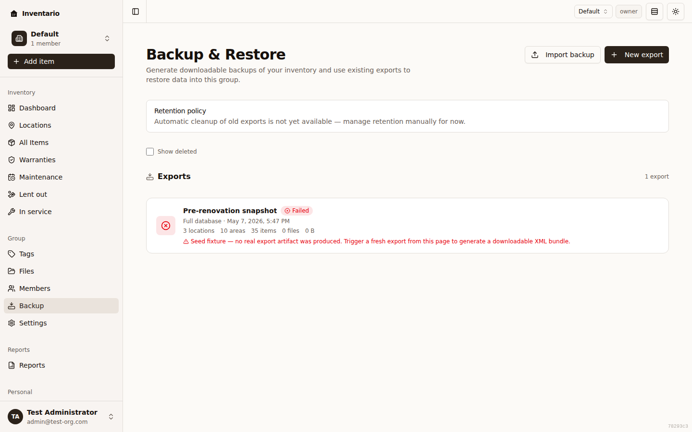

Inventario can package up your inventory into a downloadable backup so you always have your own copy — and bring that copy back later, whether to recover from a mistake or to move your data to another Inventario instance. Everything lives under **Backup** in the sidebar, on a page titled **Backup & Restore**.

This page covers creating an export, downloading it, importing a backup file, and restoring its contents into your group.

## Where to find it

Open **Backup** in the sidebar. The page lists every export that belongs to your current group, newest first, with a status badge on each one. While an export is still being built you'll see a small **Live** indicator next to the page title — the list refreshes itself, so you don't need to reload.

Two buttons sit at the top right:

- **New export** — build a fresh backup of your data.
- **Import backup** — upload an `.inb` file you saved earlier.

:::note
Exports belong to a [group](../groups-and-sharing/). What you back up and restore is always the inventory of the group you're currently in.
:::

## The .inb backup format

Backups download as `.inb` files — Inventario's own signed backup format. The file bundles your inventory data (and, if you choose, the attached file data itself) into a single archive that the server signs when it's created.

Because the file is signed, Inventario can verify it hasn't been tampered with or corrupted before it restores anything. You don't need to do anything special to benefit from this — it happens automatically when you import and restore.

:::caution
`.inb` is the format Inventario reads back, so keep the file as-is. It isn't a spreadsheet or a zip you're meant to open and edit by hand.
:::

## Create an export

1. Go to **Backup** and click **New export**.
2. On the **What to export** step, choose a scope:
   - **Full database** — everything: locations, areas, items, files, tags.
   - **Selected items** — pick specific locations, areas, or items to include. Use the search box to find locations, then choose what to add. You have to pick at least one thing.
3. Decide whether to **Include attached files (photos, invoices, manuals)**. Leave it on to bundle the actual files into the archive; turn it off for a smaller, metadata-only backup.
4. Click **Next** to reach the **Confirm** step. Optionally add a **Description** to help you recognise the export later. If you leave it blank, Inventario names it for you (for example, "Backup · Full database · 2026-05-13 10:42 UTC").
5. Review the summary and click **Create export**.

The export job runs in the background. Inventario takes you to the export's detail page, where the status badge updates on its own — **Pending**, then **In progress**, then **Completed**. The detail page also shows the scope, file size, attachments size, and counts of locations, areas, items, and files included.

## Download a backup

1. Open the export from the list (or stay on its detail page after creating it).
2. Once its status is **Completed**, click **Download**.

The browser saves a `.inb` file. Keep it somewhere safe — that file is your backup. **Download** stays disabled until the export has finished, and a backup can't be downloaded once it's been deleted.

:::tip
Storing your `.inb` files somewhere outside Inventario (a synced folder, an external drive) means you keep a copy even if you lose access to the app.
:::

## Import a backup file

If you have an `.inb` file from before — perhaps from another Inventario instance, or a download you saved — you can bring it back in.

1. Go to **Backup** and click **Import backup**.
2. Click the dropzone to choose a backup file. Only `.inb` files are accepted; anything else is rejected with "Choose a backup (.inb) file."
3. Optionally add a **Description** so you can find the import in the list later.
4. Click **Upload and continue**.

The file is staged on the server first and only inspected when you start the restore. After a successful upload, Inventario sends you straight to the restore form so you can finish the job. The imported export shows an **Imported** badge in the list and a note on its detail page.

:::caution[Backups stay with your group]
A backup restores only into the current group. Inventario confines an uploaded backup to the group that owns it — you can't import or restore someone else's backup into your group, and yours can't be pulled into theirs.
:::

## Restore a backup

Restoring brings the contents of an export into your **current group**. Open an export and click **Restore** (the import flow drops you here automatically), then choose your options.

### Pick a strategy

| Strategy | Risk | What it does |
| --- | --- | --- |
| **Merge add** | Safe | Inserts new rows; existing rows are kept untouched. |
| **Merge update** | Moderate | Inserts new rows and updates existing ones in place. |
| **Full replace** | Destructive | Wipes existing data in the destination scope before importing. |

**Full replace** removes your current data before importing, so Inventario shows a clear warning before you run it. Use it only when you really want the backup to become the source of truth.

### Other options

- **Restore attached files** — restore the actual photos, invoices, and manuals alongside the metadata. Turn it off to restore only the records. (This only has files to restore if the export was created with attachments included.)
- **Dry run** — on by default. A dry run previews exactly what *would* change without modifying any data. Always worth running first.
- **Description** — required. It's useful when you're comparing several dry-run reports.

### Run it

1. Choose your **Strategy**, decide on **Restore attached files**, and leave **Dry run** on for your first pass.
2. Type a **Description**.
3. Click **Preview restore** (when Dry run is on) or **Restore now** (when it's off).

:::tip
A dry run never touches your live data, so make a habit of previewing first, reading the report, and only then turning **Dry run** off to run the real restore.
:::

## Read the restore report

Every restore — dry run or real — produces a step-by-step log. It opens automatically when the run finishes, and you can reopen it later from the **Restore history** on the export's detail page (**View log**).

The log walks through each step with a result marker so you can see what was created, updated, or skipped, and it flags anything that errored. For a dry run the header reminds you that **No changes were made**; for a real restore it confirms the operation finished.

## Manage and delete exports

- Every export you create or import appears in the **Backup** list with its status, scope, and size.
- To remove one, open it and use the delete (trash) action, then confirm. The export is removed and its stored file is deleted — this can't be undone, and you can't delete an export while it still has a restore running.
- Deleted exports are hidden by default. Tick **Show deleted** on the list to see them.

:::note
Inventario doesn't yet clean up old exports for you — the page notes that automatic retention isn't available, so trim old backups yourself when you no longer need them.
:::

## Related

- [Items](../items/) — what gets backed up and restored.
- [Files & photos](../files-and-photos/) — the attachments an export can include.
- [Locations & areas](../locations-and-areas/) — the structure your inventory lives in.
- [Groups & sharing](../groups-and-sharing/) — backups are scoped to a group.
- [Settings & account](../settings-and-account/) — your account and preferences.
