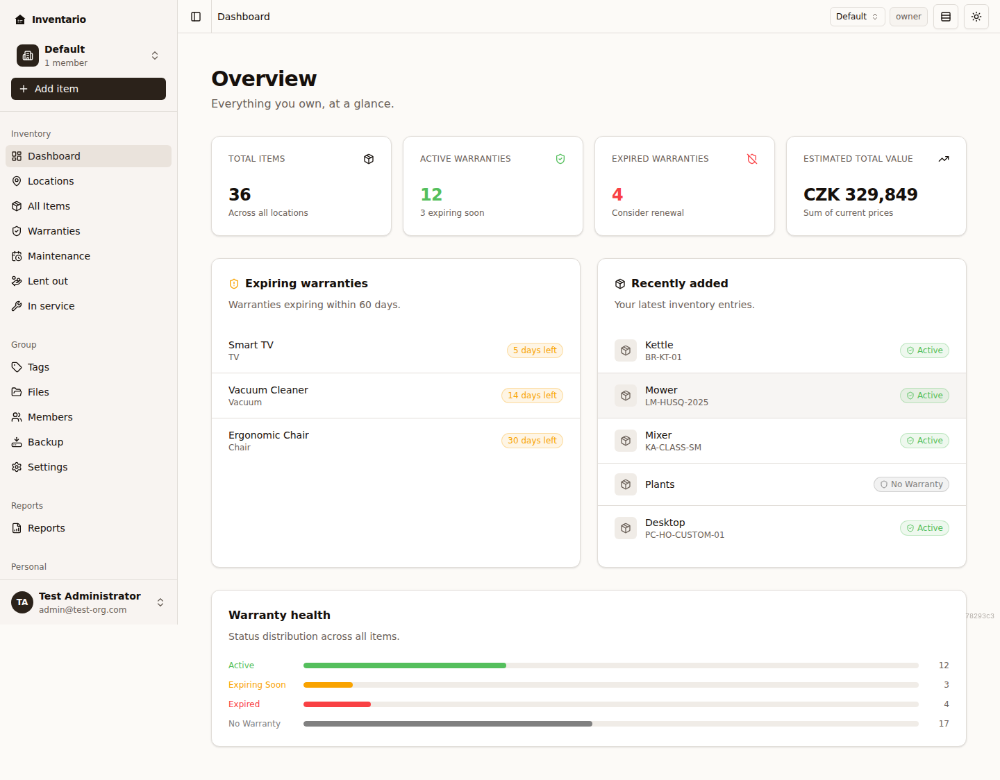
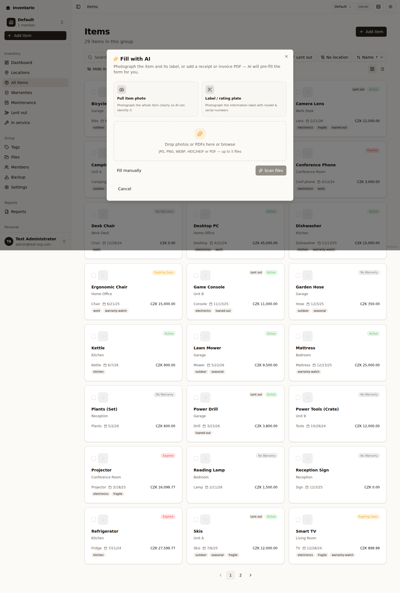

Inventario vám pomůže mít přehled o všem, co vlastníte: co to je, kde to leží, kolik to stálo a které záruky ještě platí. Na této stránce se dostanete od prázdného účtu k první uložené položce a pak vás nasměrujeme dál.

:::tip[Vestavěná prohlídka]
Aplikace obsahuje krátkou prohlídku produktu. Kdykoli si ji můžete pustit znovu — otevřete uživatelskou nabídku a zvolte **Spustit prohlídku produktu znovu**.
:::

## Přidejte první položku

**Položka** je cokoli, co chcete evidovat — spotřebič, notebook, kus nábytku, nářadí. Údaje můžete vyplnit ručně, nebo nechat AI přečíst fotku či účtenku a předvyplnit je za vás.

1. Klikněte na **Přidat položku**. Tlačítko najdete na přehledu i na stránce se všemi položkami.
2. Otevře se dialog **Přidat položku**. Začít můžete dvěma způsoby:
   - **Vyplnit pomocí AI** — přetáhněte fotku nebo PDF s účtenkou či fakturou a nechte AI formulář předvyplnit (viz [Vyplnění pomocí AI](#vyplnění-pomocí-ai) níže).
   - **Vyplnit ručně** — údaje zadáte sami.
3. Projděte jednotlivé kroky — **Základ → Nákup → Záruka → Doplňky → Soubory**:
   - **Základ** — název, množství a hlavní údaje.
   - **Nákup** — datum nákupu, cena a měna.
   - **Záruka** — datum konce záruky a poznámky.
   - **Doplňky** — nepovinná pole včetně štítků.
   - **Soubory** — volitelně připojte fotky, účtenky nebo návody (můžete je doplnit i později).
4. Kliknutím na tlačítko pro vytvoření položku uložíte. Nová položka se otevře, abyste ji mohli zkontrolovat.

:::note
Položku lze uložit i bez zařazení do umístění. V takovém případě se u ní objeví malý pruh s nabídkou **Umístit do umístění** — využijte ji kdykoli, nebo položku nechte nezařazenou.
:::

Pokud Inventario zkoušíte z veřejné úvodní stránky ještě před založením účtu, první položku si můžete načrtnout rovnou tam. Po registraci ji aplikace dokončí za vás — koncept se neztratí.

Úplný popis všech polí najdete v kapitole [Položky](../items/).

### Vyplnění pomocí AI

Pokud je na vašem serveru zapnuté rozpoznávání obrazu, AI přečte fotku nebo dokument a formulář položky předvyplní.

1. V dialogu **Přidat položku** zvolte **Vyplnit pomocí AI**.
2. Přetáhněte soubory, nebo je vyberte kliknutím. Podporované formáty: **JPG, PNG, WEBP, HEIC/HEIF a PDF** — až **5 souborů** najednou. Nejlépe funguje ostrá fotka položky i s jejím štítkem, případně PDF s účtenkou nebo fakturou.
3. AI soubory přečte a ukáže vám údaje, které z nich získala, u každého s mírou jistoty.
4. V kroku **Kontrola získaných údajů** odškrtněte všechno, co vypadá špatně, a zvolte **Použít tyto hodnoty** pro předvyplnění formuláře.
5. Položku pak uložte jako obvykle. Načtené soubory se k ní připojí automaticky.

:::caution
Pokud rozpoznávání obrazu na serveru zapnuté není, uvidíte o tom zprávu — pokračujte volbou **Vyplnit ručně**. Načítání je také omezené četností, takže občas budete před dalším pokusem chvíli čekat.
:::

## Kam dál

První položku máte uloženou. Takto z Inventaria vytěžíte víc:

- **[Umístění a oblasti](../locations-and-areas/)** — nastavte fyzická místa (dům, garáž, polici), kde vaše věci leží.
- **[Štítky](../tags/)** — volné popisky jako „křehké“ nebo „na prodej“; fungují napříč položkami nezávisle na tom, kde jsou věci uložené.
- **[Soubory a fotky](../files-and-photos/)** — připojujte účtenky, návody a fotky a procházejte všechny soubory na jednom místě.
- **[Záruky, zápůjčky a údržba](../warranties-loans-maintenance/)** — sledujte, co je v záruce, co máte půjčené jinam a co brzy potřebuje údržbu.
- **[Sestavy](../reports/)** — vytvářejte podklady pro pojišťovnu a inventární přehledy, které lze vytisknout nebo poslat.
- **[Zálohování a obnova](../backup-and-restore/)** — exportujte data, abyste měli vlastní kopii nebo je přenesli na jiný server.
- **[Skupiny a sdílení](../groups-and-sharing/)** — pozvěte do své skupiny další lidi a každému přidělte roli.

:::tip[Něco nefunguje?]
Kapitola [Řešení potíží](../troubleshooting/) pokrývá to, co se pokazí nejdřív — pošta, která nedorazí, soubor, který nejde nahrát, obnova, která udělala víc, než jste zamýšleli.

Stisknutím `?` kdekoli v aplikaci zobrazíte klávesové zkratky. Otázku, hlášení chyby nebo návrh pošlete přes **Nastavení → Nápověda a podpora → Kontaktovat podporu / poslat zpětnou vazbu**. Více najdete v kapitole [Nastavení a účet](../settings-and-account/).
:::
