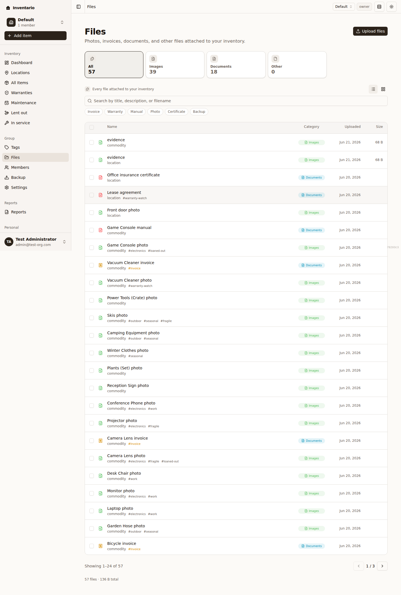
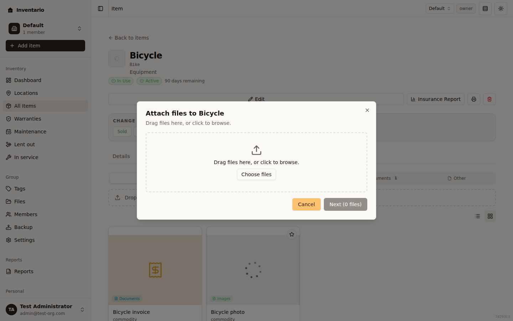
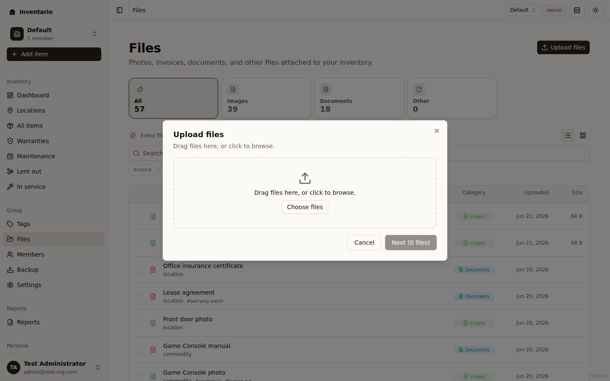

Almost everything you own comes with paperwork: a receipt, a manual, a warranty
certificate — plus the photos you take of the thing itself. Inventario lets you
attach all of it to your [items](../items/), browse it in one place, set a cover
photo, read PDFs and zoom into images right in the app, and even let AI read a
photo or receipt to fill in a new item for you. This page walks through each of
those.

## Attach files to an item

You can attach files — photos, receipts, manuals, warranty certificates,
anything — and there are a few places to do it.

**While adding an item**, use the **Files** step in the Add item dialog. Drop
files onto the dropzone or click **Choose files** to browse.

**From an existing item**, open it and go to its **Files** tab. The tab has a
dashed upload zone — click it (or the **Browse** link inside it) to open the
upload dialog, or just drag files anywhere onto the item page to drop them in.

**From a location or area**, open it and use its **Files** panel — same idea,
with an **Attach files** button.

The upload dialog itself runs in three quick steps:

1. **Select** — drop files on the dropzone or click **Choose files**. Add as
   many as you like; remove any you didn't mean to with the **×** next to it.
   Click **Next**.
2. **Adjust** — for each file you can edit the **Title**, pick a **Category**
   (**Images**, **Documents**, or **Other**), and add **Tags**. Inventario
   pre-fills the title from the filename and guesses the category from the file
   type, so you can usually skip straight ahead.
3. **Progress** — a progress bar tracks each file. When everything finishes,
   click **Close**.

Files are always optional. If you skip them while creating an item, you can add
them at any time from the item's **Files** tab.

:::tip
Attach files from *inside* the item, location, or area so they're linked to it.
Files uploaded from the global Files page (below) aren't attached to anything in
particular.
:::

## The Files page

The **Files** section in the sidebar shows every file in your group in one
place. From here you can:

- **Switch between grid and list** with the view toggle. The grid shows
  thumbnails; the list shows a compact table with name, category, size, and
  upload date. Your choice is remembered.
- **Search** by title, description, or filename.
- **Filter** by category and by tag (see the next section).
- **Upload** with the **Upload files** button — this opens the same upload
  dialog described above.

Selecting a file opens its **details** panel on the right. Tick the checkboxes
on the cards (or the list rows) to select several at once — a bar appears
letting you **Move to…** a different category or **Delete selected**.

## Categories and filters

Every file lives in one of three categories, and Inventario sorts each file
into one automatically based on its type:

| Category | What goes here |
| --- | --- |
| **Images** | Item photos — shown on cards and in galleries. |
| **Documents** | Receipts, manuals, warranties, certificates. |
| **Other** | Backups and miscellaneous files. |

At the top of the Files page, category tiles (with **All** for everything) show
a live count for each category — click one to filter to it. Below the search box
is a row of tag pills (**Invoice**, **Warranty**, **Manual**, **Certificate**,
and so on); click any of them to narrow the list to files carrying that tag, and
**Clear all** to reset. You can change a file's category later — either from its
detail panel (via **Edit metadata**) or by selecting files and using
**Move to…**.

On an item's **Files** tab the filters look a little different: a row of chips
(**All**, **Images**, **Invoices**, **Documents**, **Other**) lets you jump
between just that item's attachments, with a count on each.

:::note
For more on labelling files so the tag pills above can find them, see
[Tags](../tags/).
:::

## Set a cover photo

The cover photo is the image that represents an item on cards and in lists. It
only applies to items, and only to image files.

- By default, the **first photo** you attach to an item becomes its cover
  automatically.
- To choose a different one, open the item's **Files** tab in **grid** view and
  hover a photo. A star button appears in the corner:
  - Click the outline star to **Set as cover** (or **Pin as cover** to lock in
    the current auto-pick).
  - The current cover shows a filled star — click it again to **Clear cover**
    and fall back to the automatic pick.
- You can also tick **Use as cover photo** on a photo in the upload dialog's
  **Adjust** step while attaching it to an item.

:::note
The star only shows in grid view, and only on photos.
:::

## View images and PDFs

Open any file from the Files page or an item's **Files** tab to see its details
panel, which includes an inline preview for images and PDFs. From there you can
expand to a full-screen viewer.

### Images

Click an image preview (or the expand icon) to open the full-screen viewer:

- **Zoom** with the **+** / **−** buttons, the mouse wheel, or the `+` / `−`
  keys.
- **Pan** by clicking and dragging.
- **Reset zoom** with the reset button or the `0` key.
- **Fullscreen** fills your whole screen.
- When you opened the image from a list of photos, **←** / **→** (or the
  on-screen arrows) step through the other images in that view, with a position
  counter (for example, "2 / 7").
- Close with the **×** button or `Esc`.

### PDFs

PDFs preview inline too, and expand to a full reader with:

- A **page thumbnail** rail you can toggle, plus previous/next page buttons and
  a page-number box to jump straight to a page.
- **Zoom** in and out, plus **Fit to width** / **Fit to page**.
- A switch between **continuous scroll** and **single page** views.
- **Click-and-drag panning** when the page is bigger than the window.
- **Download** and **Close** buttons in the toolbar.

Files that aren't images or PDFs can't be previewed — the panel shows a "Preview
not available. Download to view." message, and you can open or download the file
from there.

## File details: edit, download, delete

The file details panel shows the filename, category, type, when it was uploaded,
any tags, and what the file is linked to. Tag chips are clickable — they take you
to the Files page filtered to that tag. The action row gives you:

- **Open in new tab** — opens the file in your browser.
- **Download** — saves a copy.
- **Edit metadata** — change the title, category, description, or tags. (This
  only edits the metadata; the file itself isn't changed.)
- **Delete file** — removes the file permanently after a confirmation.

:::caution
**Delete file** is permanent. The file is removed for good once you confirm.
:::

## Scan an item from a photo or PDF with AI

If AI vision is enabled on your server, Inventario can read a photo or document
and pre-fill a new item for you. This is the **Fill with AI** option in the Add
item dialog.

1. Click **Add item**, then choose **Fill with AI**.
2. Drop in your files, or browse to pick them. Supported formats are **JPG,
   PNG, WEBP, HEIC/HEIF, or PDF** — up to **5 files** at a time. A clear photo
   of the item plus its label (the plate with model and serial numbers) works
   well, and so does a receipt or invoice PDF.
3. Click **Scan files**. AI reads them — you can **Cancel** while it works.
4. On **Review extracted details**, each field (name, type, price, serial
   number, purchase date, warranty expiry, tags, and more) shows what AI found,
   with a confidence label. Untick anything that looks wrong.
5. Click **Use these values** to pre-fill the form, then finish and save the
   item as usual.

A few things to know:

- The files you scanned are **attached to the item automatically** — photos go
  to **Images**, PDFs to **Documents** — so you don't have to upload them again.
- If AI finds **more than one product** (for example, on a multi-item receipt),
  it asks you to **Choose which item to add** and pre-fills that one — you can
  add the others separately afterwards.
- When a receipt or invoice is read, the seller's name is put into the item's
  **comments** (there's no separate seller field).
- If a price's currency isn't on the server's supported list, it won't be
  pre-filled, and the review step tells you so.
- Scanning is **rate-limited** to keep usage fair, so you may occasionally be
  asked to wait a moment before trying again.

:::note
If AI vision isn't enabled on your server, you'll see a message saying so — just
use **Fill manually** to continue. Whether AI vision is available depends on how
your server is configured (see [Self-hosting](../self-hosting/)).
:::

For more on creating items, see [Items](../items/); for organising your files
with labels, see [Tags](../tags/). To keep your files safe, see
[Backup and restore](../backup-and-restore/).
