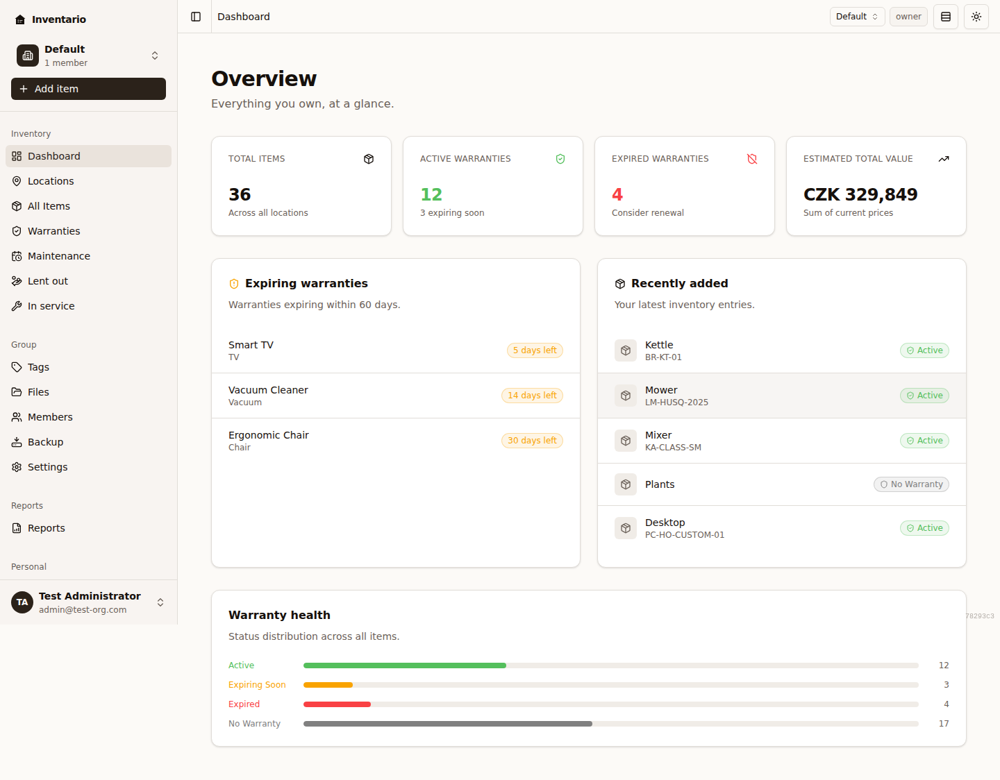

Welcome! Inventario helps you keep track of everything you own — what it is, where it lives, what it cost, and which warranties are still active. This page gets you from an empty account to your first saved item, then points you at the deeper guides.

:::tip[Take the built-in tour]
The app includes a short product tour. To see it again at any time, open the user menu and choose **Restart product tour**.
:::

## Add your first item

An **item** is anything you want to keep track of — an appliance, a laptop, a piece of furniture, a tool. You can fill in the details by hand, or let AI read a photo or receipt and pre-fill them for you.

1. Click **Add item**. The button is on the Dashboard and on the All Items page.
2. The **Add item** dialog opens. You can start two ways:
   - **Fill with AI** — drop in a photo or a receipt/invoice PDF and let AI pre-fill the form for you (see [Fill with AI](#fill-with-ai) below).
   - **Fill manually** — type the details yourself.
3. Work through the steps — **Basics → Purchase → Warranty → Extras → Files**:
   - **Basics** — name, quantity, and core details.
   - **Purchase** — purchase date, price, and currency.
   - **Warranty** — warranty expiry date and notes.
   - **Extras** — optional fields, including tags.
   - **Files** — optionally attach photos, receipts, or manuals (you can also add these later).
4. Click the create button to save. Your new item opens so you can review it.

:::note
Items don't have to be placed in a location to be saved. If you skip that, the item appears with a small banner offering to **Place in location** — you can do that whenever you like, or leave it unassigned.
:::

If you're trying Inventario from the public landing page before creating an account, you can draft your first item right there. After you sign up, the app finishes adding it for you — your draft is never lost.

See [Items](../items/) for a full reference to every field.

### Fill with AI

If AI vision is enabled on your server, you can let it read a photo or document and pre-fill the item form for you.

1. In the **Add item** dialog, choose **Fill with AI**.
2. Drop in your files, or click to browse. Supported formats: **JPG, PNG, WEBP, HEIC/HEIF, or PDF** — up to **5 files** at a time. A clear photo of the item plus its label (or a receipt/invoice PDF) works best.
3. AI reads the files and shows you the details it extracted, with a confidence indicator for each.
4. On the **Review extracted details** step, untick anything that looks wrong, then choose **Use these values** to pre-fill the form.
5. Finish and save the item as usual. The files you scanned are attached to the item automatically.

:::caution
If AI vision isn't enabled on your server, you'll see a message saying so — just use **Fill manually** to continue. Scanning is also rate-limited to keep usage fair, so you may occasionally be asked to wait a moment before trying again.
:::

## Where to go next

Once your first item is in, here's how to make the most of Inventario:

- **[Locations & areas](../locations-and-areas/)** — set up the physical places (a house, a garage, a shelf) where your items live.
- **[Tags](../tags/)** — flexible labels like "fragile" or "to sell" that work across items, independent of where things are stored.
- **[Files & photos](../files-and-photos/)** — attach receipts, manuals, and photos, and browse every file in one place.
- **[Warranties, loans & maintenance](../warranties-loans-maintenance/)** — track what's under warranty, what you've lent out, and upcoming upkeep.
- **[Reports](../reports/)** — generate insurance and inventory views you can print or share.
- **[Backup & restore](../backup-and-restore/)** — export your data to keep your own copy or move it to another instance.
- **[Groups & sharing](../groups-and-sharing/)** — invite other people into your group and give each of them a role.

:::tip[Need more help?]
Press `?` anywhere in the app for keyboard shortcuts, or open **Settings → Help & support → Contact support / share feedback** to ask a question, report a bug, or suggest a feature. See [Settings & account](../settings-and-account/) for more.
:::
