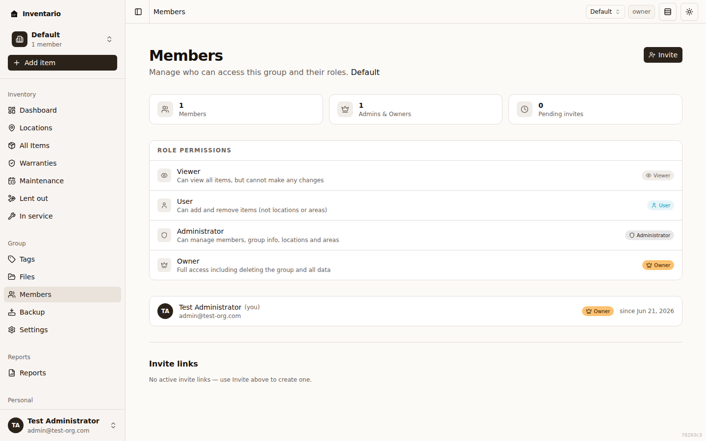
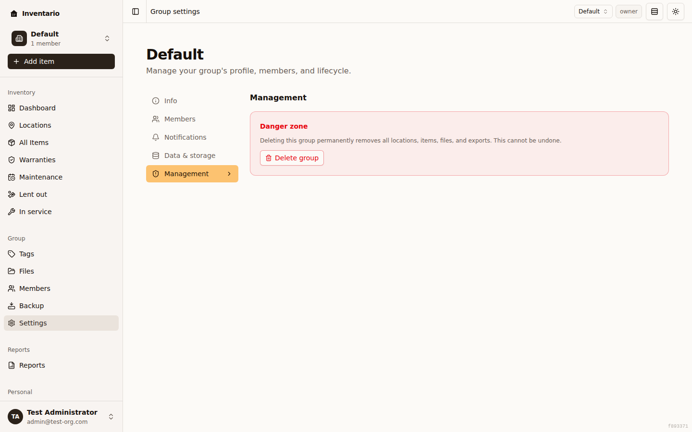

Inventario organises everything you track into **groups**. A group is a complete, self-contained inventory — its own [locations and areas](../locations-and-areas/), [items](../items/), [files](../files-and-photos/), [tags](../tags/), and [backups](../backup-and-restore/). You can belong to several groups at once (your home, a holiday flat, a small business), switch between them whenever you like, and invite other people into any group with a role that decides what they can do.

## What a group is

Think of each group as a separate inventory that doesn't mix with your others. Items, locations, files, and tags all live inside one group — switching groups swaps the whole view in the app. The people you invite into a group only ever see that group's data, never your other groups.

Everyone who is signed in starts with at least one group, and the sidebar always shows which one you're currently working in.

## Create a group

You can create as many groups as you need.

1. Open the group selector at the top of the sidebar (it shows the current group's name and member count).
2. Choose **Create new group**.
3. On the **Create a new group** page, fill in:
   - **Group name** — for example "Main residence".
   - **Icon** — optional; pick something to make the group easier to recognise in the sidebar.
   - **Group currency** — the currency this inventory's prices are tracked in (see [The group currency](#the-group-currency)).
4. Click **Create group**. The new group opens straight away and becomes your active group.

## The group currency

Every group has one **group currency** — the currency all of its item prices and totals are shown in. You choose it when you create the group, using a 3-letter ISO code (for example **USD**, **EUR**, or **CZK**).

:::caution[Set once at creation]
The group currency is fixed when you create the group. To change it later you'd use the currency-migration tool in **Group settings → Info**, which reprices every item in the group at an exchange rate you provide. That tool is only available if your server operator has enabled it; if it's switched off you'll see a note saying so.
:::

## Switch the active group

The active group decides what the whole app shows you.

1. Open the group selector at the top of the sidebar.
2. Pick the group you want from the list. A check mark shows which one is currently active.

The app switches to that group immediately.

:::tip
You can keep two browser tabs open on two different groups — they stay independent of each other. The same dropdown also has shortcuts to **Group settings** (for the current group) and **Create new group**.
:::

## Invite people by email

You invite people from the **Members** page. You need to be an **Owner** or **Administrator** of the group to send invites.

1. Open **Members** in the sidebar.
2. Click **Invite**.
3. In the **Invite to …** dialog, enter the person's **Email address**.
4. Choose a **Role** — **Viewer**, **User**, or **Administrator** (you can't invite someone straight in as Owner; see [Members and roles](#members-and-roles)).
5. Click **Send invite**. They'll receive an invite link by email.

### Copy-paste invite links

If you'd rather hand someone a link yourself instead of emailing it, choose **Or create a copy-paste invite link instead** in the invite dialog. Inventario generates a link you can copy and share however you like — by message, chat, or in person. Anyone who opens a valid link can use it to join the group with the role you picked.

## Members and roles

Each member of a group has one **role** that controls what they can do. The **Members** page shows everyone in the group with their role, and a **Role permissions** card explains each role.

| Role | What they can do |
| --- | --- |
| **Owner** | Full access including deleting the group and all data. |
| **Administrator** | Can manage members, group info, locations and areas. |
| **User** | Can add and remove items (not locations or areas). |
| **Viewer** | Can view all items, but cannot make any changes. |

A group can have more than one owner. The **Members** page also shows quick stats at the top: total **Members**, **Admins & Owners**, and **Pending invites**.

:::note
If you're a User or Viewer, you can see the member list but you won't see the invite, role-change, or remove controls — those are limited to admins and owners.
:::

## Change a member's role

You need to be an **Owner** or **Administrator**.

1. Open **Members** in the sidebar.
2. Find the member and open their actions menu (the **⋯** button on their row).
3. Under **Change role**, pick the new role.

A few rules apply:

- Only **owners** can promote someone to **Owner** or change another owner's role. Administrators can manage everyone except owners.
- You can't change your own role from this menu.
- You can't demote the **last owner**. Promote someone else to owner first, or [delete the group](#delete-a-group) instead. The app blocks this for you and explains why.

## Manage pending invites

Invites that haven't been accepted yet appear in the **Invite links** section of the **Members** page, each marked with a **Pending** badge. Owners and administrators can act on them via the **⋯** menu on each invite row:

- **Resend invite** — send the invite email again (available for email invites).
- **Copy** — copy the invite link to your clipboard so you can share it another way.
- **Revoke** — cancel the invite. The link stops working and the person can no longer use it to join.

Invites that have already been used can't be revoked.

## Leave a group

If you no longer want to be part of a group, you can leave it.

1. Open the group selector and choose **Group settings**, then open the **Members** section.
2. In the **Leave group** panel, click **Leave group**.

You'll lose access to all of that group's data, but you can be re-invited later.

:::caution[Last owner can't leave]
You can't leave a group if you're its **last owner** — that would strand the group with no one able to manage it. Promote another member to owner first, or delete the group. If you're the only member at all, delete the group instead of leaving.
:::

## Remove a member

Owners and administrators can remove other people from a group.

1. Open **Members** in the sidebar.
2. Open the **⋯** menu on the member's row and choose **Remove**.
3. Confirm in the dialog.

The person loses access to the group's data immediately, and you can re-invite them later. You can't remove the **last owner** (promote someone else first), and the menu doesn't offer a remove action on your own row — use [Leave a group](#leave-a-group) for that.

## Delete a group

Deleting a group is permanent and removes **all** of its locations, items, files, and exports. Only an **Owner** can do it.

1. Open the group selector and choose **Group settings**, then open the **Management** section.
2. Under **Danger zone**, click **Delete group**.
3. In the confirmation dialog, type the **group name** and your **current password**, then click **Delete permanently**.

The group name guards against an accidental click; your password protects against someone using a hijacked session.

:::caution[No undo]
There's no way to recover a deleted group. If you might want the data later, create a [backup](../backup-and-restore/) first.
:::

## Related guides

- [Locations and areas](../locations-and-areas/) — organise where things live inside a group.
- [Settings and account](../settings-and-account/) — your personal preferences and profile.
- [Backup and restore](../backup-and-restore/) — export a group's data before big changes.
