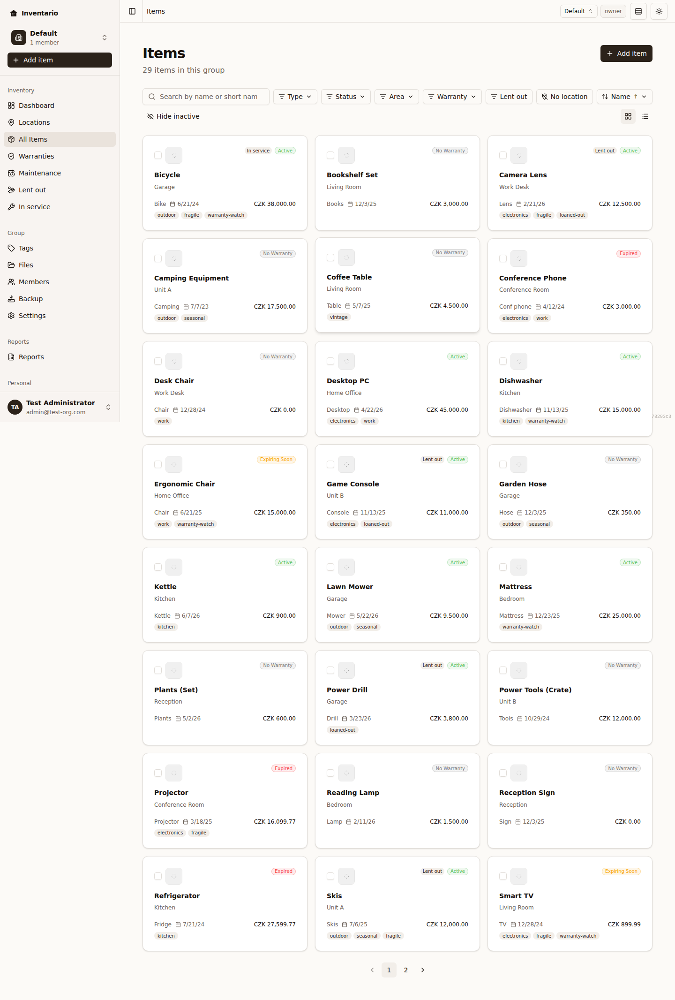
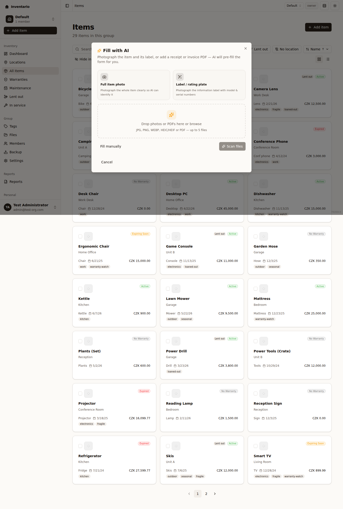
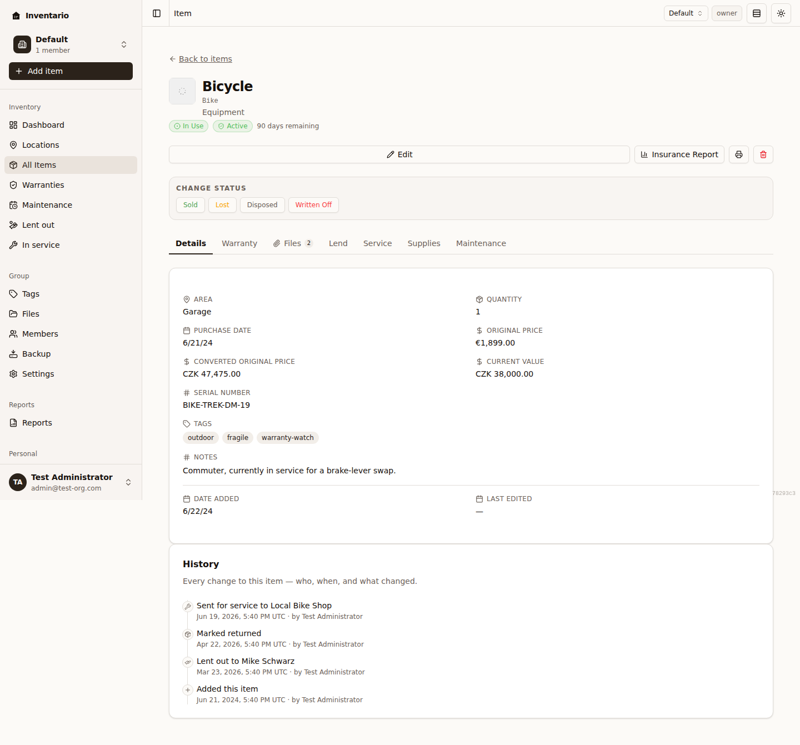
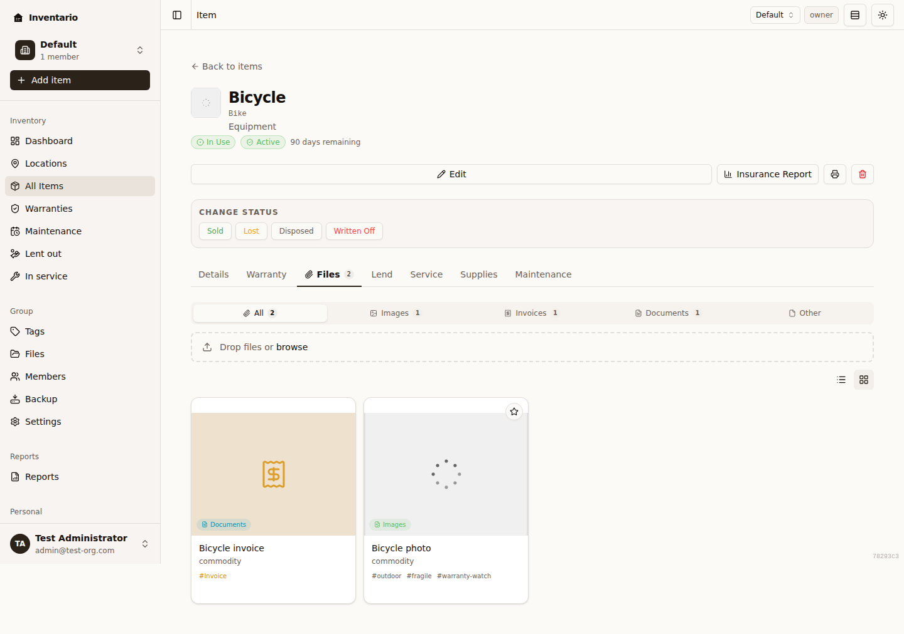
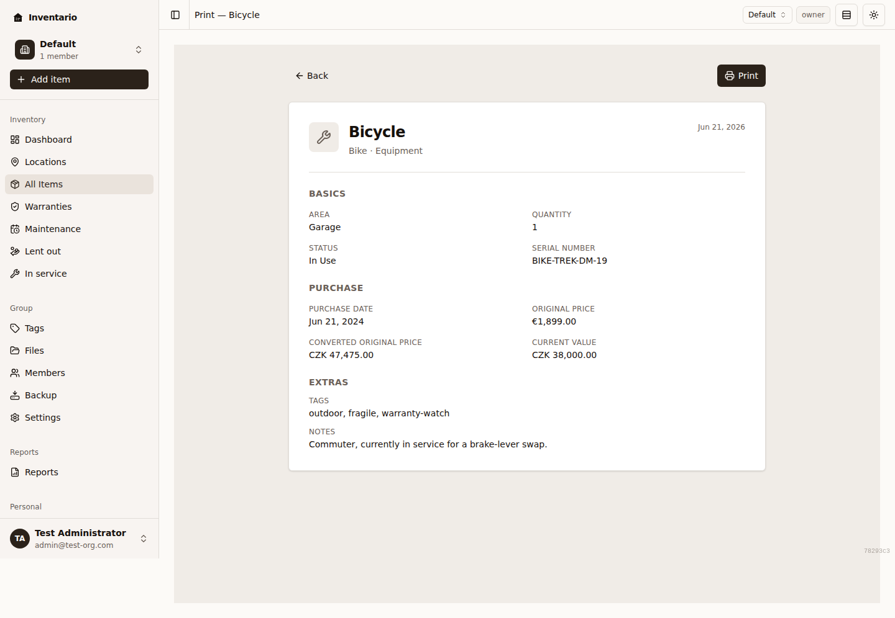

An **item** is anything you want to keep track of — an appliance, a laptop, a
piece of furniture, a tool. This page covers everything about items: adding
them (manually or with AI), every field on the form, the item detail page and
its tabs, the status lifecycle, prices and currencies, the cover photo, and
how to find, sort, and bulk-edit items on the **All Items** page.

## Add an item

1. Click **Add item** (the button is on the Dashboard and on the **Items**
   page).
2. The **Add item** dialog opens. If AI scanning is enabled on your server, it
   starts on the **Fill with AI** screen; otherwise it opens straight on the
   form.
3. Choose how to start:
   - **Fill with AI** — drop in a photo or a receipt/invoice PDF and let AI
     pre-fill the form (see [The Add item dialog, step by step](#the-add-item-dialog-step-by-step)).
   - **Fill manually** — type the details yourself.
4. Work through the steps and click **Add item** on the last step to save. Your
   new item opens so you can review it.

:::tip
Items don't have to be placed in a location to be saved. If you skip the area,
the item shows a small banner offering to **Place in location** — do that
whenever you like, or leave it unassigned. See
[Locations & areas](../locations-and-areas/).
:::

## The Add item dialog, step by step

The dialog has five numbered steps, shown as a segmented progress bar at the
top: **Basics → Purchase → Warranty → Extras → Files**. Use **Continue** and
**Back** to move between them, or click a segment you've already visited to jump
straight to it. The same dialog is used to edit an existing item — its title
changes to **Edit item** and the final button reads **Save changes**.

### Fill with AI

If AI vision is enabled on your server:

1. On the **Fill with AI** screen, drop in your files or click to browse.
   Supported formats: **JPG, PNG, WEBP, HEIC/HEIF or PDF — up to 5 files**. A
   clear photo of the item plus its label, or a receipt/invoice PDF, works
   best.
2. Click **Scan files**. AI reads them and, on the **Review extracted details**
   step, shows each value it found with a confidence indicator.
3. Untick anything that looks wrong, then click **Use these values** to
   pre-fill the form.
4. The files you scanned are attached to the item automatically — manage them
   on the **Files** step.

A few things to know:

- If AI finds more than one product, it pre-fills the most prominent one and
  lets you add the others separately afterwards.
- If AI vision isn't enabled, you'll see a message saying so — click **Fill
  manually** to continue.
- Scanning is rate-limited, so you may occasionally be asked to wait a moment.

See [Files & photos](../files-and-photos/) for more on attachments.

## All the fields

The form is split across the five steps. Only a handful of fields are required
(marked with an asterisk in the app).

### Basics

| Field | Notes |
| --- | --- |
| **Name** * | The full name, e.g. "Bosch SMV6ZCX42E dishwasher". |
| **Short name** * | A 1–40 character label used in compact lists. |
| **Product URLs** | Links to the product page, support, or docs. Add as many as you like. |
| **Type** * | **Appliance**, **Electronics**, **Equipment**, **Furniture**, **Clothes**, or **Other**. |
| **Quantity** * | How many you own (see [Quantity and bundles](#quantity-and-bundles)). |
| **Location** / **Area** | Where the item lives. Pick a location first, then an area. Both are optional. See [Locations & areas](../locations-and-areas/). |
| **Status** * | Starts as **In Use** (see [Status lifecycle](#status-lifecycle)). |

### Purchase

| Field | Notes |
| --- | --- |
| **Purchase date** | When you bought it. Can't be in the future. |
| **Original price** | What you paid, in the original purchase currency. |
| **Current value** | Current resale / insurance value, in the group currency. |
| **Serial number** | Found on the device label or packaging. |

If the original price is in a different currency from your group, an extra field
appears for the **converted purchase price** in the group currency — see
[Prices and currencies](#prices-and-currencies).

### Warranty

| Field | Notes |
| --- | --- |
| **Warranty expires on** | Leave empty if there's no warranty. The system emails reminders 60, 30, and 7 days before this date. |
| **Warranty notes** | Registration number, extended plan, contact, etc. |

A live status pill previews how the warranty will show on the list —
**Active**, **Expiring Soon**, or **Expired**. For the full warranty workflow,
see [Warranties, loans & maintenance](../warranties-loans-maintenance/).

### Extras

| Field | Notes |
| --- | --- |
| **Notes** | Maintenance tips, filter models, anything useful. |
| **Tags** | Pick from the list or type your own and press Enter or comma. See [Tags](../tags/). |
| **Extra serial numbers** | For multi-component products that carry several. |
| **Part numbers** | Manufacturer part numbers, useful when reordering parts. |

### Files

Attach anything related to the item — photos, receipts, manuals. Drop files on
the dropzone or click to browse. Inventario sorts each file into **Photos**,
**Documents**, or **Other** based on its type; you can change a file's category
later from its detail page. Files are always optional and can be added at any
time. More in [Files & photos](../files-and-photos/).

## Quantity and bundles

Quantity must be at least **1**. When you set quantity greater than 1, the item
becomes a **bundle**, and per-unit tracking is turned off.

:::caution[Bundles can't be tracked per unit]
Bundles don't support **warranty**, **lending**, or **service** tracking. If
you need any of those for individual units, split the bundle into separate
items.
:::

## Prices and currencies

Inventario tracks two prices: the **Original price** (what you paid, in its own
currency) and the **Current value** (resale or insurance value, in your group's
currency).

When the original price is in a currency other than the group currency, the form
shows a banner — *"The group uses [currency]…"* — and asks you to enter at least
one of:

- **Converted purchase price** — what you paid, expressed in the group currency.
- **Current value** — in the group currency.

:::note
Supplying one of these makes the item reportable in your group currency, which
matters for [Reports](../reports/) and dashboards. Your group's currency is set
in [Settings & account](../settings-and-account/).
:::

## Save as draft

A **Save as draft** toggle sits above the steps on every form step. With it on,
the required-field rules are relaxed so you can capture a few details now and
finish later — drafts show a **Draft** badge in lists.

:::tip[You won't lose work by accident]
If you try to close the dialog with unsaved changes, Inventario asks whether to
**Save as draft**, **Discard**, or **Keep editing**.
:::

## The item detail page

Opening an item shows its detail page, with the cover photo, key facts, and a
row of tabs.

- **Details** — name, status, type, location/area, prices, serial numbers, part
  numbers, links, tags, notes, and dates.
- **Warranty** — expiry, notes, and a reminder of how long is left. See
  [Warranties, loans & maintenance](../warranties-loans-maintenance/).
- **Files** — every file attached to this item, filterable by **All**,
  **Images**, **Documents**, **Invoices**, or **Other**, with a grid/list
  toggle.
- **Lend** — lend the item out and track its return.
- **Service** — send the item for repair and track its return.
- **Supplies** — consumables associated with the item.
- **Maintenance** — maintenance schedule and history.

The header also has:

- **Edit** — reopens the form dialog.
- **Insurance Report** and **Print** — printable views (see [Reports](../reports/)).
- **Delete** — permanently removes the item and any attached files.

A **History** section lists every change — who, when, and what — including
status changes, price changes, moves, and cover-photo changes.

:::note
Lending, service, and supplies tracking are only available on single-unit
items, not bundles.
:::

## The cover photo

The cover photo is the image shown on cards and at the top of the detail page.
If you haven't picked one, Inventario uses the first photo you attached. To set
or change it, open the **Files** tab, find the image you want, and choose to set
it as the cover. You can also clear the cover to fall back to the first photo.

## Status lifecycle

Every item has a status. New items start as **In Use**. From there you can mark
an item as:

| Status | What it means |
| --- | --- |
| **In Use** | The item is in active use (the default). |
| **Sold** | You sold it. You're prompted to record the **sale price** and a note. |
| **Lost** | You can't find it — you can revert later. |
| **Disposed** | Permanently removed from your inventory. |
| **Written Off** | Written off, usually for insurance or accounting. |

To change status, open the item and use the **Change Status** buttons. Marking
an item as anything other than In Use opens a short dialog where you record the
**date**, an optional **note**, and — for **Sold** — the **sale price**.

Once an item is in one of these end states, the detail page shows that status
(with the captured date, note, and sale price) and a **Revert to In Use**
button so you can put it back into active use at any time.

## The All Items page: search, filter, sort

The **Items** page lists every item in your group. Across the top you have:

- **Search** — type in the search box to match by name or short name.
- **Type** — filter by one or more item types.
- **Status** — filter by **In Use**, **Sold**, **Lost**, **Disposed**, or
  **Written Off**.
- **Area** — narrow to a single area, or **All areas**.
- **Warranty** — filter by warranty state (active, expiring, expired, or none).
- **Lent out** — show only items currently lent out.
- **No location** — show only items not placed in any area.
- **Sort by** — **Name**, **Date added**, **Purchase date**, **Current value**,
  **Original price**, or **Quantity**.
- **Clear filters** — reset everything back to the default view.
- **Show inactive / Hide inactive** — include or hide items in an end status.

A **Grid view** / **List view** toggle switches the layout.

:::tip[Bookmark a filtered view]
Your filters and sort are kept in the page URL, so you can bookmark or share a
filtered view.
:::

## Select, move, and delete in bulk

On the **Items** page you can act on several items at once:

1. Tick the checkbox on each item you want, or use **Select all visible** to
   grab everything on the page.
2. A bulk-action bar appears showing how many items are selected.
3. Choose an action:
   - **Move…** — pick a **destination area** and confirm with **Move items**.
   - **Delete** — permanently removes the selected items. You'll be asked to
     confirm first, since this can't be undone.

To clear your selection, untick the items or reload the page.
