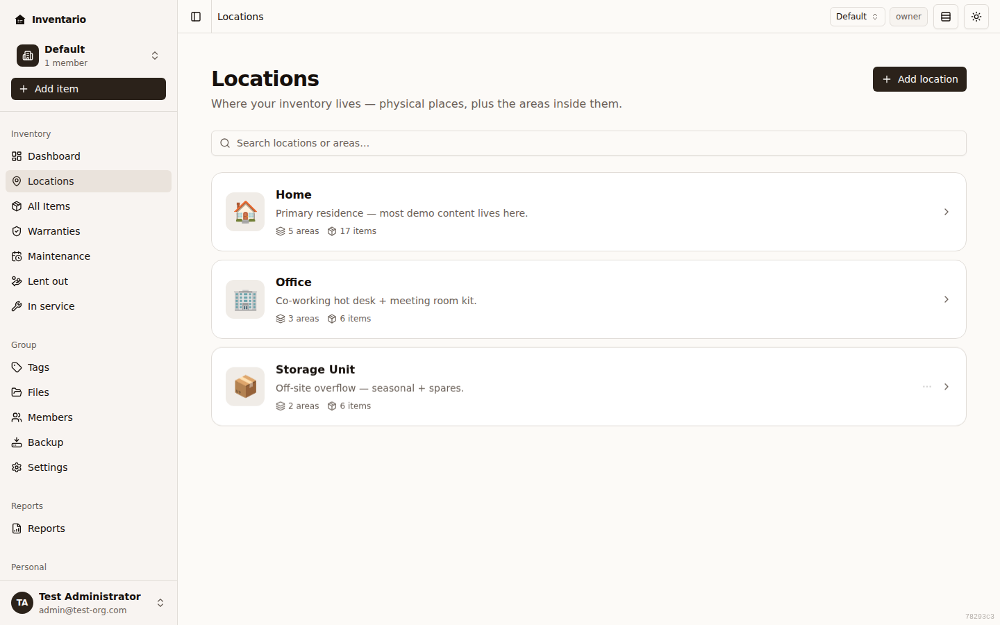
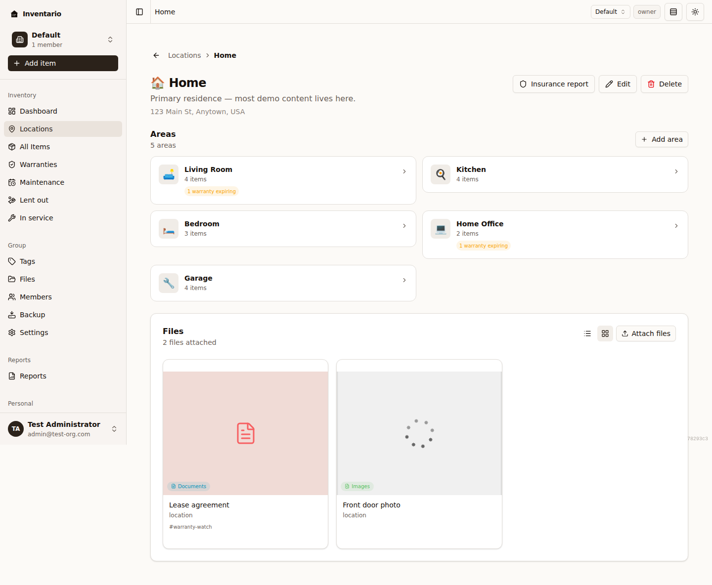
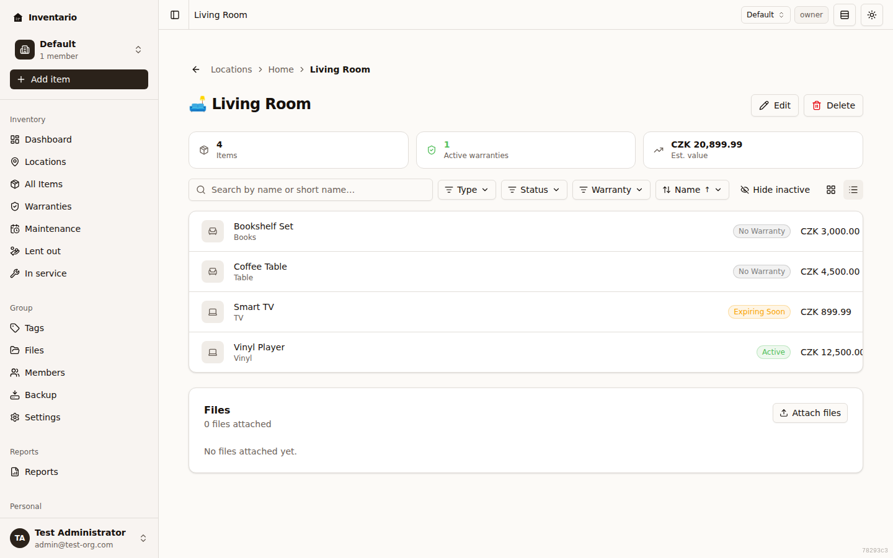
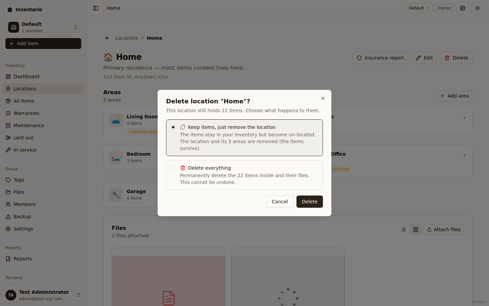

Locations and areas are how Inventario maps your inventory to the real world. A **location** is a physical place you keep things — a house, a flat, a garage, a storage unit, a vehicle. An **area** is a subdivision inside a location — a Kitchen, a Garage, an Office, a specific shelf. Items live inside areas, so the hierarchy is always **location → area → item**.

This page walks you through creating and editing both, placing items, the "No location" state, and what happens when you delete a container that still holds things.

## How the hierarchy works

- A **location** can hold any number of **areas**.
- An **area** belongs to exactly one location, and is where items actually live — an item is filed under an area, never directly under a location.
- An item's location is derived from its area: pick the area, and Inventario knows which location it's in.

Open **Locations** in the sidebar to see every location in your current group. Each location is a card showing its icon, name, a one-line description (or address), and stat chips for how many **areas** and **items** it holds. Click a card to open the location, where you'll see its areas laid out as tiles and a Files panel underneath. Click an area tile to open the area, which shows the items inside it with search, filters, sorting, and a grid/list toggle.

:::note
On large groups the item counts on cards and tiles are sampled, so a very full location may show a count like **12+** or a dash (**—**) rather than an exact number. Open the area itself for the precise total.
:::

## Create a location

1. Go to **Locations** in the sidebar.
2. Click **Add location**.
3. In the **Add location** dialog, fill in:
   - **Icon** (optional) — pick an emoji to make the location easy to spot.
   - **Name** (required) — for example "Main House", "Garage", or "Cottage".
   - **Description** (optional) — a short note shown as the muted subtitle under the name.
   - **Address** (optional) — a street address, a room, or any free-text note.
4. Click **Add location** to save.

The new location appears in the list straight away. A location with no areas yet shows a **No areas yet** prompt when you open it.

## Create an area

You can add an area from a few places:

- On the **Locations** page, open a location's **⋯** menu and choose **Add area**.
- Inside a location, click **Add area** (in the **Areas** section header, or on the **No areas yet** card).

Then:

1. In the **Add area** dialog, fill in:
   - **Icon** (optional).
   - **Name** (required) — for example "Kitchen", "Living Room", or "Workshop".
   - **Parent location** — which location the area belongs to. This picker only appears when you have **more than one** location; with a single location the area is filed there automatically. If you started from a specific location, that location is pre-selected.
2. Click **Add area** to save.

The area shows up as a tile on its location's page. Click the tile to open the area and start adding items.

## Edit a location or area

**To edit a location:** open it and click **Edit**, then update the icon, name, description, or address and click **Save changes**.

**To edit an area:** open the area and click **Edit**, or use an area tile's **⋯** menu and choose **Edit**. You can change the icon and name, and — from the **Parent location** picker — move the area (and everything in it) to a different location. Click **Save changes** when you're done.

## Assign an item to an area

When you first create an item, Inventario doesn't ask where it lives — you can save it and place it later (see [Items](../items/) for the full add flow). You file an item into an area from its **Edit** form:

1. Open the item and click **Edit**.
2. On the **Basics** step, use the paired **Location** and **Area** pickers:
   - Choose a **Location** first.
   - The **Area** picker stays disabled (showing **Pick a location first**) until you do; once a location is chosen it lists only that location's areas. Choose one.
3. Save the item. It now appears on that area's page and counts toward the location's stats.

:::tip
If you pick a different **Location**, the **Area** selection clears so you can choose a fresh one — areas can't span locations.
:::

## The "No location" state and un-assigning

An item that hasn't been filed into an area is shown as **No location**. This is a perfectly valid state — items don't need a location to exist, and you can leave them un-located indefinitely.

- **Spotting un-located items:** on the Items list you can filter by **No location** to find everything that still needs a home.
- **The placement nudge:** right after you create an item (and any time it has no area but your group has at least one location), its detail page shows a **Place this item in a location?** banner. Click **Place in location** to jump straight to the edit form's pickers, or **Dismiss** it for the session.
- **Un-assigning an item:** open the item, click **Edit**, and use **Clear location** to remove its area. The item stays in your inventory but goes back to **No location**.

Deleting a location or area (below) can also leave items un-located in bulk.

## Delete a location or area

How deletion behaves depends on whether the container is empty:

- **Empty location or area** — you get a simple confirmation. Click **Delete** to remove it. (An empty area, when removed, simply disappears; deleting an empty location removes it outright.)
- **Non-empty location or area** — Inventario shows a dedicated dialog that makes you choose what happens to the contents. This protects you from wiping out a populated location by accident.

To start a delete:

- **A location:** open its **⋯** menu on the Locations page and choose **Delete**, or open the location and click **Delete**.
- **An area:** use an area tile's **⋯** menu and choose **Delete**, or open the area and click **Delete**.

### The cascade-vs-unlink choice

When the container still holds items (or, for a location, areas), the **Delete** dialog offers two options. The safe option is selected by default:

- **Keep items, just remove the area** / **Keep items, just remove the location** (the default) — the items stay in your inventory but become **un-located**. Only the container is removed. For a location this also removes its areas, but the items inside those areas survive — they just lose their area assignment.
- **Delete everything** — permanently deletes the items inside *and their attached files*, along with the container.

Choose an option, then click **Delete**. If you change your mind, **Cancel**, press Escape, or click outside the dialog.

:::caution
**Delete everything** cannot be undone — the items inside and their attached files are permanently removed. When in doubt, keep the default and re-file the items later.
:::

:::tip
Un-located items show up under the **No location** filter on the Items list, so nothing is ever truly lost when you choose to keep items — you can re-file them into a new area whenever you like.
:::

## Related guides

- [Items](../items/) — adding, editing, and finding the things you store.
- [Files & photos](../files-and-photos/) — locations and areas have their own Files panels, too.
- [Reports](../reports/) — generate an insurance report scoped to a single location.
- [Tags](../tags/) — flexible labels that work across items, independent of where they're stored.
- [Backup & restore](../backup-and-restore/) — export a full database or just selected locations, areas, or items.
