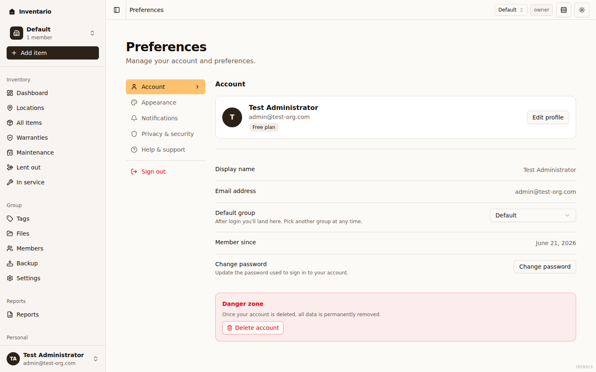
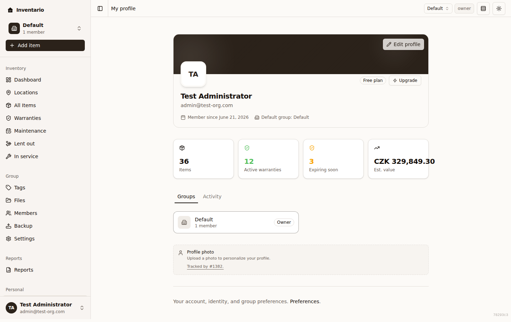

Everything about your account, your preferences, and keeping it secure lives in
one place. In the sidebar, under **Personal**, you'll find **Profile** (your
identity and groups at a glance) and **Preferences** (the settings hub). This
guide walks through the parts of **Preferences** that are about *you* rather than
your inventory: your profile details, how the app looks and speaks to you,
account security, sign-in methods, and where to get help.

The **Preferences** page has a left-hand menu with five sections — **Account**,
**Appearance**, **Notifications**, **Privacy & security**, and **Help &
support** — plus a **Sign out** shortcut at the bottom of that menu.

## Your profile

Open **Profile** from the sidebar to see your identity card — your name, email,
a snapshot of your inventory (items, active warranties, expiring soon, estimated
value), and the groups you belong to.

To change your details, click **Edit profile** (it's on both the Profile page
and the **Account** section of Preferences). On the **Edit profile** page you
can:

1. Update your **Name**.
2. Choose your **Default group** — the group you land in after signing in. You
   can switch groups any time from the group selector.
3. Click **Save changes**.

A couple of things to know:

- Your **email address** is shown but can't be edited here. To change the email
  on your account, contact support.
- You can **delete your account** yourself from the **Account** section's
  "Danger zone". Clicking **Delete account** opens a confirmation dialog where
  you type your email address to confirm and — for password accounts — re-enter
  your password. (Accounts that sign in only with Google or another social
  provider don't need to enter a password.) Deletion is **permanent and can't be
  undone**: it erases your account together with the inventory you own, so
  export or back up anything you want to keep first. A couple of cases are
  blocked with an explanation instead of deleting: if you're the **only owner**
  of a group that still has other members, hand ownership to someone else first;
  and if you still own items shared inside a group someone else owns, those need
  to be removed first. Once deletion succeeds you're signed out immediately.

For more on groups, roles, and inviting people, see
[Groups & sharing](../groups-and-sharing/).

## Appearance and preferences

The **Appearance** section controls how the app looks and formats things. Each
change applies immediately.

- **Theme** — choose **Light**, **Dark**, or **System** (follows your device's
  setting). Stored on this device.
- **Density** — **Comfortable** or **Compact**; Compact tightens headers and
  lists. Stored on this device.
- **Language** — switch the app's language between **English**, **Čeština**, and
  **Русский**. This also sets the language Inventario uses for emails it sends
  you.
- **Default view** — whether the Items list opens in **Grid** or **List**. You
  can still flip the layout per session from the toolbar.
- **Preferred currency** — a saved preference for how currency should be
  displayed. It's stored on your account, but display conversion isn't wired up
  yet, so amounts still show in their stored currency for now.
- **Region & formatting** — how numbers, dates, and currencies are formatted
  (separators, symbol placement). This is independent of the UI language, so you
  can keep the interface in English while formatting numbers the Czech way, for
  example. Leave it on **Auto-detect (browser)** to follow your browser.

:::note
**Theme** and **Density** are stored on the device you're using, so each browser
or computer can have its own look. Your other preferences travel with your
account.
:::

The **Notifications** section lets you turn individual email/push reminders on
or off — warranty expiry, maintenance, loans, the weekly digest, price-drop
alerts, and which channels to use. Those reminders tie into your inventory; see
[Warranties, loans & maintenance](../warranties-loans-maintenance/) for what they
cover.

## Change your password

Everything below lives in the **Privacy & security** section of Preferences,
except the password form, which is on the **Edit profile** page.

1. Go to **Edit profile** (from **Profile**, or from **Account → Change
   password** in Preferences).
2. Click **Change password** to expand the form.
3. Enter your **Current password**, then a **New password**, and confirm it. A
   strength meter helps you pick something strong.
4. Click **Change password** to save.

:::caution
When you change your password, Inventario signs you out **everywhere** — every
device has to sign in again with the new password — and you'll be returned to
the sign-in page.
:::

:::tip
If you signed up with Google or GitHub and never set a password, the
**Edit profile** page shows a **Set password** form instead, so you can add one.
:::

## Two-factor authentication

Two-factor authentication (2FA) adds a second step at sign-in: a six-digit code
from an authenticator app such as Google Authenticator, 1Password, or Authy. The
**Two-factor authentication** row in **Privacy & security** shows whether it's
**Active** or **Inactive**.

### Set it up

1. In **Privacy & security**, click the **Two-factor authentication** row.
2. **Scan the QR code** with your authenticator app. Can't scan? Use the
   **Manual setup key** shown beneath it.
3. Enter the **Verification code** from your app and click **Verify & enable**.
4. Inventario shows your **backup codes**. Save them somewhere safe — each one
   is single-use and you won't see them again. Use **Copy codes** if you like.
5. Tick **I have saved these codes somewhere safe**, then click **Done**.

:::caution
Your backup codes are shown only once. Store them somewhere safe before you
finish setup — if you lose your authenticator and have no backup codes left,
you'll need to contact support to regain access.
:::

### Use a backup code

If you can't reach your authenticator at sign-in, you can enter one of your
backup codes instead of the six-digit code. Each backup code works once. If
you're running low, the **Two-factor authentication** row warns you so you can
set 2FA up again to get a fresh set.

### Turn it off

1. In **Privacy & security**, click the **Two-factor authentication** row (it
   now opens the disable dialog).
2. Enter your **Password** and a current **Authenticator code** — or switch to
   **Use a backup code instead** and enter a backup code.
3. Click **Disable**.

## Active sessions

Open **Active sessions** from **Privacy & security** to see every device and
browser currently signed in to your account. Each card shows the browser and
operating system, when the session was last used and created, and a partial IP
address. Your current device is marked **This device**.

- To sign out a single device, click **Revoke** on its card and confirm.
- To sign out everything except where you are now, use **Sign out all other
  sessions** (shown when you have other sessions) and confirm. Your current
  session stays active.

:::tip
This is a good thing to check if you ever see unfamiliar sign-in activity.
:::

## Login history

Open **Login history** from **Privacy & security** for a recent, reverse-order
list of sign-in attempts — both successful and failed — so you can spot anything
suspicious. Each entry shows the outcome (for example **Success**, **Failed:
bad password**, or **MFA required**), the sign-in method, the time, and the IP
address and device where available.

If there have been several failed attempts (more than three) in the last seven
days, a banner at the top points it out. If you don't recognise the activity, change your password
and revoke any sessions you don't trust.

## Connected accounts

If your Inventario server has Google or GitHub sign-in enabled, a **Connected
accounts** panel appears in **Privacy & security**. It lets you link those
providers so you can sign in without a password.

- To link a provider, click **Link Google** / **Link GitHub** and complete the
  sign-in with that provider. Once linked, the row shows the provider's email
  and when you linked it.
- To unlink, click **Unlink** and confirm. Inventario lists the sign-in methods
  you'd have left so you can be sure you won't lock yourself out.

:::caution
You can't unlink your **only** remaining way to sign in. If a provider is your
last method, set a password first (or link another provider) before unlinking it.
:::

:::note
If your server hasn't enabled any sign-in providers, this panel doesn't appear.
:::

## Help & support and feedback

The **Help & support** section gives you four quick links:

- **Documentation** — opens the user guide in a new tab.
- **Keyboard shortcuts** — opens the full list of shortcuts (you can also press
  `?` anywhere in the app).
- **What's new** — opens the releases page in a new tab.
- **Contact support / share feedback** — opens a form to ask a question, report
  a bug, or suggest a feature. The same form is your channel for reaching the
  team directly.

---

See also: [Getting started](../getting-started/) ·
[Groups & sharing](../groups-and-sharing/) ·
[Backup & restore](../backup-and-restore/)
