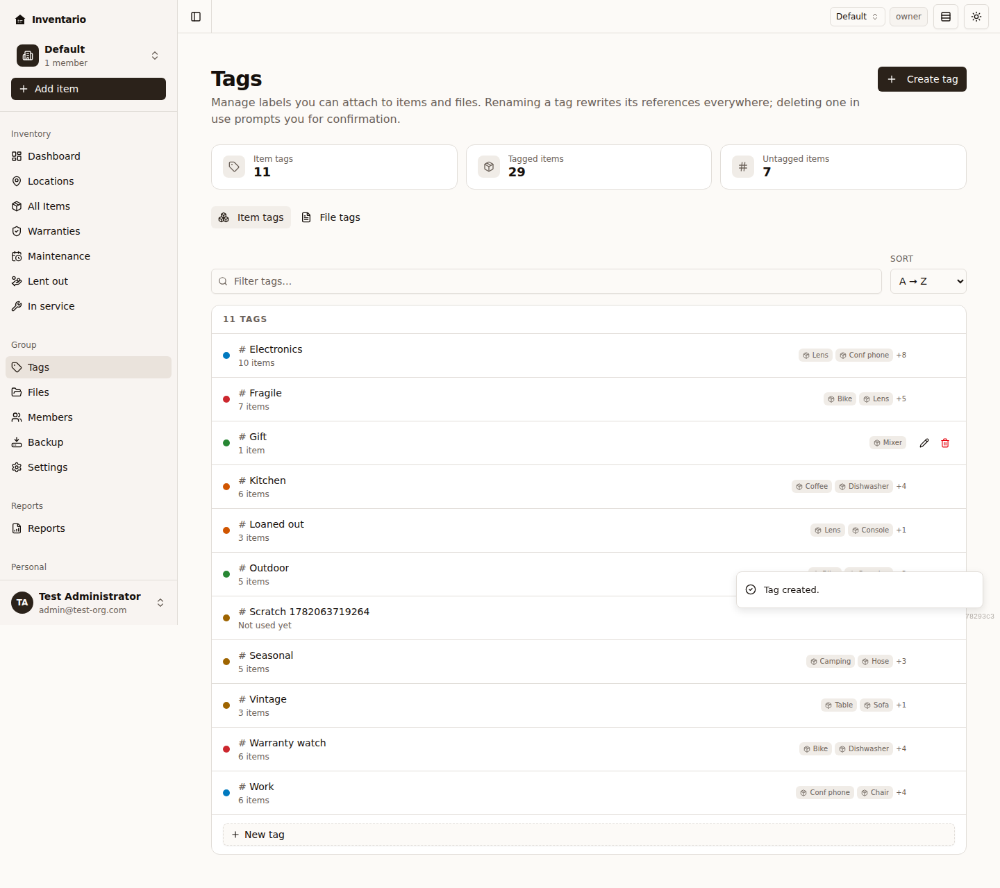
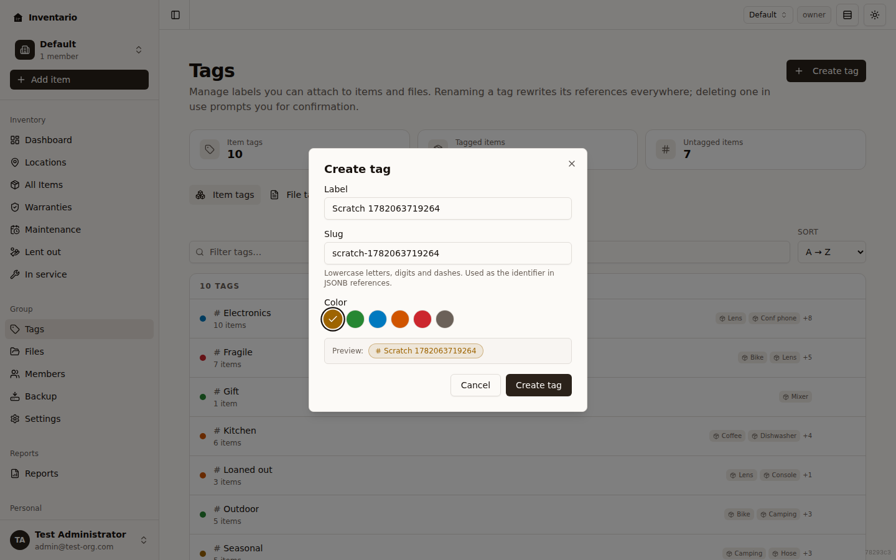

**Tags** are flexible labels you stick on things to group them however you like — "fragile", "electronics", "to sell", "insured". They don't depend on where something is stored, so you can use them to cut across your inventory in ways that locations and areas can't.

Inventario keeps **item tags** and **file tags** as two completely separate sets. A tag you put on items doesn't show up when you tag files, and vice versa — they're managed side by side on the same page but never mixed.

## Item tags vs file tags

Tags come in two kinds, and they're kept apart on purpose:

- **Item tags** are labels you attach to your [items](../items/) — a laptop, an appliance, a tool.
- **File tags** are labels you attach to your [files](../files-and-photos/) — receipts, manuals, photos, certificates.

Because the two sets are independent, you can reuse the same name in both — an "invoice" file tag and an "invoice" item tag are two different tags. At the top of the Tags page a switcher lets you flip between them:

- **Item tags** — shows the tags used on items.
- **File tags** — shows the tags used on files.

:::note
There is no combined "All" view — you're always looking at exactly one kind at a time. The page remembers which one you were last on, so it reopens where you left off.
:::

## Open the Tags page

1. Click **Tags** in the sidebar.
2. The page opens on **Item tags** by default. Use the switcher near the top to change to **File tags** whenever you need to.

At the top you'll see a small stats bar for the kind you're viewing — for item tags it shows **Item tags** (the total), **Tagged items**, and **Untagged items**; for file tags it shows **File tags**, **Tagged files**, and **Untagged files**.

:::tip
A tag only appears in these lists once it's actually used somewhere. A brand-new account shows an empty list with a hint like *"No tags used on items yet"* until you apply your first tag.
:::

## Apply a tag to an item or file

You don't have to create tags up front on the Tags page — most of the time you just type them where you need them, and they start showing up once they're in use.

**On an item:**

1. While adding or editing an item, go to the **Extras** step.
2. In the tags field, type a label and press **Enter** (or comma) to add it as a chip. As you type, Inventario suggests matching item tags you've used before.
3. Save the item.

**On a file:**

1. Open a file's detail view, or edit a file, and find its tags field.
2. Type a label and press **Enter** (or comma) to add it; **Backspace** on an empty field removes the last chip. Suggestions here are drawn from your file tags.
3. Save your changes.

See [Items](../items/) and [Files & photos](../files-and-photos/) for the full add/edit flows.

## Create a tag

You can also create a tag directly on the Tags page — handy when you want to set its colour, or get it ready before you start tagging.

:::caution
A new tag is created for whichever kind the switcher is currently on, so flip to **Item tags** or **File tags** first.
:::

### Quick add (inline)

1. At the bottom of the tag list, click **New tag**.
2. Type the tag's name, optionally pick a colour, and press **Enter** or click the check to save.
3. The row stays open so you can add another tag right away. Press **Escape** or click the cancel button to close it.

With the quick adder, the identifier (the **slug**) is generated from the name for you.

### Full create dialog

For more control — including a custom slug — use the dialog:

1. Click **Create tag** in the top-right of the page.
2. Fill in:
   - **Label** — the display name, for example "Kitchen". Up to 64 characters.
   - **Slug** — the lowercase, dash-separated identifier (for example `kitchen`). It's filled in from the label automatically; edit it only if you want a different identifier. Lowercase letters, digits, and dashes only.
   - **Color** — pick one of the available colours (Amber, Blue, Green, Muted, Orange, Red). A live **Preview** shows how the tag will look.
3. Click **Create tag**.

:::note
If a tag with the same slug already exists for that kind, Inventario tells you and the tag isn't created — pick a different name or slug.
:::

## Edit a tag

1. Hover over a tag in the list and click the **Edit tag** (pencil) button.
2. Change the **Label**, **Slug**, or **Color**.
3. Click **Save changes**.

Renaming a tag updates it everywhere it's used — every item or file that carries it picks up the new name and colour automatically.

## Delete a tag

1. Hover over a tag in the list and click the **Delete tag** (trash) button.
2. Confirm:
   - If the tag isn't used anywhere, you get a simple **Delete tag?** prompt. Click **Delete**.
   - If the tag is still attached to items or files, you get a **Tag is in use** warning that tells you how many items and files reference it. Choosing **Force delete** removes the tag from those items and files first, then deletes it.

:::caution
Deleting a tag can't be undone. Force-deleting only strips the tag — your items and files themselves are untouched.
:::

## Find and sort your tags

When you have a lot of tags, the toolbar above the list helps you narrow down:

- **Search** — start typing in the **Filter tags…** box to show only tags whose name matches. Clear it with the **X** to see everything again. (This searches within the kind you're viewing.)
- **Sort** — reorder the list with the **Sort** dropdown:
  - **A → Z** / **Z → A** — alphabetical by name.
  - **Most used** — the tags on the most items or files first.
  - **Newest** — most recently created first.

Each row shows the tag's colour dot, its name, and how many items and/or files use it (or *"Not used yet"*). On item tags, a couple of sample item names appear on the right as a quick preview.

## Filter by tag

Tags are most useful when you turn them into a filter.

### Files

On the [Files](../files-and-photos/) page there's a row of tag-filter pills in the toolbar (such as **invoice**, **warranty**, **manual**, **photo**, **certificate**, and **backup**). Click a pill to show only files carrying that tag; click more than one to combine them. **Clear all** removes the tag filters.

### Items

On the [Items](../items/) list, each item shows its tags as small badges so you can spot them at a glance. The Items list filters by **Type**, **Status**, **area**, and **warranty** rather than by tag, so to gather items by a single tag, look for that tag's badge on the cards.

## Related

- [Items](../items/) — add tags on the **Extras** step.
- [Files & photos](../files-and-photos/) — tag files and filter by tag pills.
- [Locations & areas](../locations-and-areas/) — organise by where things live.
- [Getting started](../getting-started/) — the big-picture overview.
