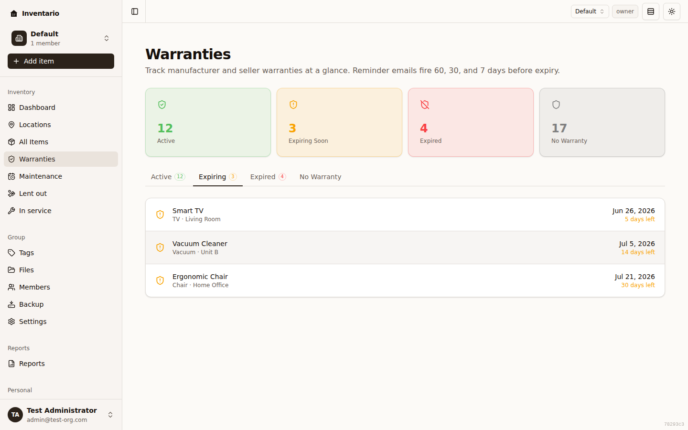
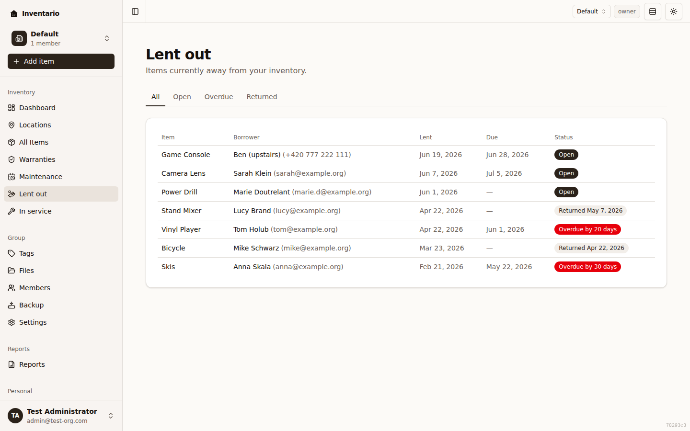
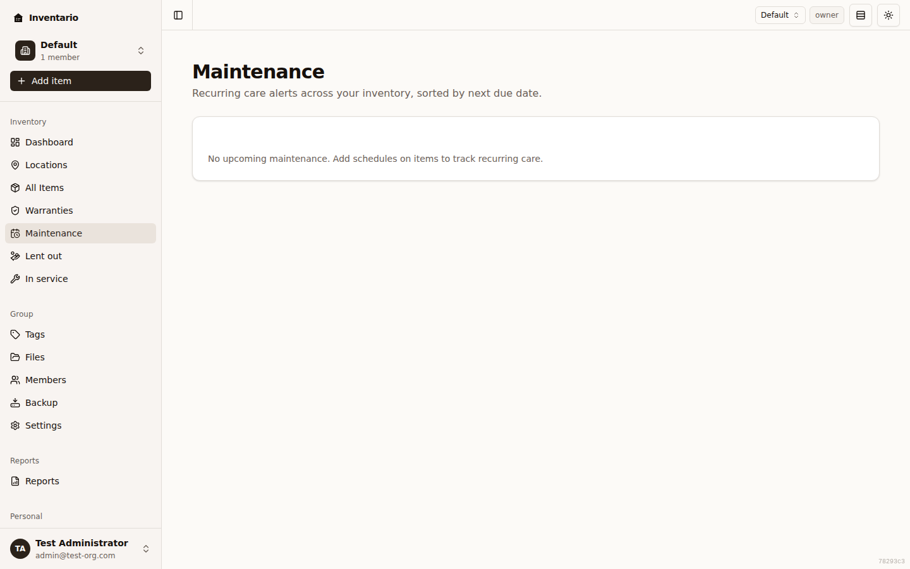

Beyond *what* you own and *where* it lives, Inventario helps you stay on top of the things that have a clock attached: warranties that lapse, items you've lent to someone, and recurring care like filter or oil changes. Each of these has its own page in the sidebar so you can see everything at a glance, and Inventario can email you reminders before a date sneaks up on you.

This guide covers all three. They share a pattern: a group-wide overview page in the sidebar for *seeing* what's coming up, and a tab on each item for *editing* the details.

## Warranties

A warranty is tracked as a single expiry date on an item, plus optional notes. Inventario uses that date to sort your items into status buckets and to send reminders before cover runs out.

### Add or change a warranty date

Warranty details live on the item itself — the **Warranty** tab on an item is a read-only summary, so you set the date by editing the item.

1. Open the item and edit it (or use the **Edit** action).
2. Go to the **Warranty** step of the form.
3. Fill in **Warranty expires on** — the date the manufacturer or seller cover ends. Leave it empty if there's no warranty to track.
4. Optionally add **Warranty notes** — a registration number, an extended-plan reference, a contact, and so on.
5. Save. The item's **Warranty** tab now shows the status, the expiry date, and how many days are left (or how long ago it expired).

:::tip
To keep the receipt or warranty certificate handy, use the **Upload Receipt** button on the item's Warranty tab — it opens the same upload dialog as the **Files** tab. See [Files & photos](../files-and-photos/).
:::

:::note
Items with a quantity greater than 1 are treated as a bundle and don't support per-unit warranty tracking. If you need a warranty on one unit, split it into a separate item.
:::

### The Warranties page

Open **Warranties** in the sidebar for a group-wide view. At the top, four summary cards count your items by warranty status. Below them, tabs let you focus on one bucket at a time:

| Tab | What's in it |
| --- | --- |
| **Expiring** | Warranties expiring in the next 60 days — the most actionable bucket, shown first. |
| **Active** | Items still comfortably under warranty. |
| **Expired** | Warranties that have already lapsed, most-recently-expired on top. |
| **No Warranty** | Tracked items that don't have a warranty date set yet. |

Each row shows the item name, its area, the expiry date, and a coloured "**N days left**" or "**N days ago**" line so you can see urgency at a glance. Click any row to jump straight to that item's **Warranty** tab.

## Lent out (loans)

When you lend something to a friend, family member, or colleague, you can record who has it and when it's due back. Inventario keeps the item in your inventory but marks it as **Lent out**, and can remind you when a return is due or overdue.

### Lend an item out

1. Open the item and go to its **Lend** tab.
2. Click **Lend out…**.
3. In the **Lend out** dialog, fill in:
   - **Borrower** — who has the item (required), for example "Anna from accounting".
   - **Contact** — optional, free-form (phone, email, @handle) for your own reference.
   - **Lent on** — defaults to today; change it if you lent it earlier.
   - **Due back** — optional. Leave it empty for an open-ended loan.
   - **Note** — optional, anything worth remembering.
4. Click **Lend out**. The item now shows a current-loan card on the Lend tab.

:::note
An item can only be in one place at a time: if it's currently out for repair (see Service), you'll need to mark it received back before you can lend it.
:::

### Mark a return, edit, or remove a loan

On the item's **Lend** tab, the open loan appears as a card:

- **Mark returned** — closes the loan and records today as the returned date.
- **Edit** — change the borrower name, contact, note, or due date on an open loan. (The lent-on date is fixed for the audit trail; on a loan you've already returned, the dates are locked too — delete and recreate it if you need to fix a date.)
- **Remove** — deletes the loan record. This is meant for fixing a typo; the past-loan history is normally kept.

Returned loans drop into a **Past loans** list below the card so you keep a history of who borrowed what.

### The Lent out page

Open **Lent out** in the sidebar for a group-wide table of every loan. Filter with the tabs along the top:

- **All** — every loan (the default).
- **Open** — currently lent and not yet overdue.
- **Overdue** — past the due-back date.
- **Returned** — closed loans.

Each row shows the item, borrower (with contact if you added one), lent date, due date, and a status badge — **Open**, **Overdue by N days**, or **Returned** on a given date. Click an item name to open it and manage the loan from its **Lend** tab.

## Maintenance schedules

A maintenance schedule is recurring care attached to an item — replacing a water filter, an oil change, descaling a machine. You set how often it's due, and Inventario tracks the next due date and reminds you before it arrives.

### Add a schedule

1. Open the item and go to its **Maintenance** tab.
2. Click **Add schedule**.
3. Fill in the **Add maintenance schedule** dialog:
   - **Title** — what the task is, for example "Replace water filter".
   - **Every (days)** — how often the task recurs.
   - **Next due (optional)** — a starting due date. Leave it blank to start the clock from when you first mark it done.
   - **Notes** — optional details, like "Use NSF-53 filter, comes in 2-packs".
4. Click **Create**. The schedule appears as a card with its next-due date.

:::note
Like warranties and loans, maintenance can't be set on a bundle (quantity greater than 1). Split it into separate items first.
:::

### Keep a schedule up to date

Each schedule card on the **Maintenance** tab gives you:

- **I did this** — records today as the last-done date and advances the next-due date by the interval. Use it every time you complete the task.
- **Edit** — change the title, cadence, due date, or notes.
- **Delete** — remove the schedule.
- A **switch** to pause a schedule. A paused schedule stops sending reminders and shows a **Paused** badge; flip it back on when you want reminders again.

Cards are tinted and badged by urgency: **Overdue** (with how many days) or **Due soon** when the next date is within two weeks.

### The Maintenance page

Open **Maintenance** in the sidebar for a group-wide table of every schedule, sorted by next-due date. Each row shows the item, the schedule title and its interval, the next-due date (with an **Overdue** or **Due soon** badge), and when it was last done. Click an item name to open its **Maintenance** tab. Rows that are overdue or due soon are highlighted so the urgent ones stand out.

## Reminder emails

Inventario sends reminder emails so you don't have to keep checking these pages:

- **Warranties** — 60, 30, and 7 days before the expiry date.
- **Loans** — when an item you've lent out is due back or overdue.
- **Maintenance** — 14, 7, and 1 day before each due date.

You control which of these you receive under **Settings → Notifications**, where **Warranty expiry**, **Loan reminders**, and **Maintenance reminders** each have their own toggle, alongside the email and push channel settings. See [Settings & account](../settings-and-account/) for the full list.

:::caution
Reminders are sent to the email address on your account, so make sure it's current. Paused maintenance schedules and returned loans don't generate reminders.
:::

## Related guides

- [Items](../items/) — adding items and editing their details, including the Warranty step.
- [Files & photos](../files-and-photos/) — attaching receipts, certificates, and manuals.
- [Reports](../reports/) — printable views of your inventory.
- [Settings & account](../settings-and-account/) — notification preferences.
